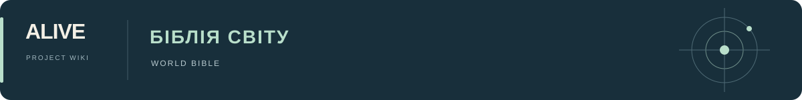

# Біблія ALIVE — карта світу

[Головна](../README.md) · [Робоче місце](../TEAM_DASHBOARD.md) · [Джерела](../Sources/README.md) · [Питання](../Decisions/Open_Questions.md)

Шість основних напрямів: історія, персонажі, світ, середовища, технології та розробка. Приміщення згруповано за рівнями станції; окремий файл для кожної кімнати не потрібний. Нижче збережено повний зміст попереднього довідника й покажчика карток.

| Потрібно | Де читати |
|---|---|
| [Історія](Story.md) | сюжет → хронологія → стани й втрати |
| [Персонажі](Characters.md) | склад героїв → зовнішність → одяг і особисті речі |
| [Світ](World.md) | просторовий устрій → керування → доступ → вірус |
| [Станція загалом](Environments/Station.md) | корпус, екстер’єри, ангари й космічний транспорт |
| [Другий рівень](Environments/Second_Level.md) | площа, школа, дитсадок, квартири й торгівля |
| [Нижній рівень](Environments/Lower_Level.md) | бази, ванна, цехи, ворота й закриті ангари |
| [Третій рівень](Environments/Third_Level.md) | службові приміщення, склади, каюти, медицина й рубка |
| [Побут і матеріали](Environments/Everyday_Life.md) | тепло, кухня, їжа, санітарія, меблі й ремонт |
| [Технології](Technology/README.md) | роботи, транспорт, зброя, інтерфейси й медицина |
| [Візуальна й звукова розробка](Visual_Development.md) | стиль, дизайн, режисура, звук і концепти |

## Зміст документа

- [Арт-дирекшн ALIVE: предметний світ роману](README.md#%D0%B0%D1%80%D1%82-%D0%B4%D0%B8%D1%80%D0%B5%D0%BA%D1%88%D0%BD-alive-%D0%BF%D1%80%D0%B5%D0%B4%D0%BC%D0%B5%D1%82%D0%BD%D0%B8%D0%B9-%D1%81%D0%B2%D1%96%D1%82-%D1%80%D0%BE%D0%BC%D0%B0%D0%BD%D1%83)
  - [Тематичні частини](README.md#%D1%82%D0%B5%D0%BC%D0%B0%D1%82%D0%B8%D1%87%D0%BD%D1%96-%D1%87%D0%B0%D1%81%D1%82%D0%B8%D0%BD%D0%B8)
  - [Як читати картку](README.md#%D1%8F%D0%BA-%D1%87%D0%B8%D1%82%D0%B0%D1%82%D0%B8-%D0%BA%D0%B0%D1%80%D1%82%D0%BA%D1%83)
  - [Що цей пакет додає до короткої біблії](README.md#%D1%89%D0%BE-%D1%86%D0%B5%D0%B9-%D0%BF%D0%B0%D0%BA%D0%B5%D1%82-%D0%B4%D0%BE%D0%B4%D0%B0%D1%94-%D0%B4%D0%BE-%D0%BA%D0%BE%D1%80%D0%BE%D1%82%D0%BA%D0%BE%D1%97-%D0%B1%D1%96%D0%B1%D0%BB%D1%96%D1%97)
  - [Суперечності й сюжетні стани](README.md#%D1%81%D1%83%D0%BF%D0%B5%D1%80%D0%B5%D1%87%D0%BD%D0%BE%D1%81%D1%82%D1%96-%D0%B9-%D1%81%D1%8E%D0%B6%D0%B5%D1%82%D0%BD%D1%96-%D1%81%D1%82%D0%B0%D0%BD%D0%B8)
  - [Джерела й збереження](README.md#%D0%B4%D0%B6%D0%B5%D1%80%D0%B5%D0%BB%D0%B0-%D0%B9-%D0%B7%D0%B1%D0%B5%D1%80%D0%B5%D0%B6%D0%B5%D0%BD%D0%BD%D1%8F)
- [Покажчик карток дизайну світу](README.md#%D0%BF%D0%BE%D0%BA%D0%B0%D0%B6%D1%87%D0%B8%D0%BA-%D0%BA%D0%B0%D1%80%D1%82%D0%BE%D0%BA-%D0%B4%D0%B8%D0%B7%D0%B0%D0%B9%D0%BD%D1%83-%D1%81%D0%B2%D1%96%D1%82%D1%83)
  - [Станція, екстер’єри й космічний транспорт](README.md#%D1%81%D1%82%D0%B0%D0%BD%D1%86%D1%96%D1%8F-%D0%B5%D0%BA%D1%81%D1%82%D0%B5%D1%80%D1%94%D1%80%D0%B8-%D0%B9-%D0%BA%D0%BE%D1%81%D0%BC%D1%96%D1%87%D0%BD%D0%B8%D0%B9-%D1%82%D1%80%D0%B0%D0%BD%D1%81%D0%BF%D0%BE%D1%80%D1%82)
  - [Другий рівень: громадські простори й дитяче середовище](README.md#%D0%B4%D1%80%D1%83%D0%B3%D0%B8%D0%B9-%D1%80%D1%96%D0%B2%D0%B5%D0%BD%D1%8C-%D0%B3%D1%80%D0%BE%D0%BC%D0%B0%D0%B4%D1%81%D1%8C%D0%BA%D1%96-%D0%BF%D1%80%D0%BE%D1%81%D1%82%D0%BE%D1%80%D0%B8-%D0%B9-%D0%B4%D0%B8%D1%82%D1%8F%D1%87%D0%B5-%D1%81%D0%B5%D1%80%D0%B5%D0%B4%D0%BE%D0%B2%D0%B8%D1%89%D0%B5)
  - [Нижній рівень: бази, комунікації й закриті ангари](README.md#%D0%BD%D0%B8%D0%B6%D0%BD%D1%96%D0%B9-%D1%80%D1%96%D0%B2%D0%B5%D0%BD%D1%8C-%D0%B1%D0%B0%D0%B7%D0%B8-%D0%BA%D0%BE%D0%BC%D1%83%D0%BD%D1%96%D0%BA%D0%B0%D1%86%D1%96%D1%97-%D0%B9-%D0%B7%D0%B0%D0%BA%D1%80%D0%B8%D1%82%D1%96-%D0%B0%D0%BD%D0%B3%D0%B0%D1%80%D0%B8)
  - [Третій рівень: виробництво, людські приміщення й рубка](README.md#%D1%82%D1%80%D0%B5%D1%82%D1%96%D0%B9-%D1%80%D1%96%D0%B2%D0%B5%D0%BD%D1%8C-%D0%B2%D0%B8%D1%80%D0%BE%D0%B1%D0%BD%D0%B8%D1%86%D1%82%D0%B2%D0%BE-%D0%BB%D1%8E%D0%B4%D1%81%D1%8C%D0%BA%D1%96-%D0%BF%D1%80%D0%B8%D0%BC%D1%96%D1%89%D0%B5%D0%BD%D0%BD%D1%8F-%D0%B9-%D1%80%D1%83%D0%B1%D0%BA%D0%B0)
  - [Роботи: корпус, рух, інструменти й поведінка](README.md#%D1%80%D0%BE%D0%B1%D0%BE%D1%82%D0%B8-%D0%BA%D0%BE%D1%80%D0%BF%D1%83%D1%81-%D1%80%D1%83%D1%85-%D1%96%D0%BD%D1%81%D1%82%D1%80%D1%83%D0%BC%D0%B5%D0%BD%D1%82%D0%B8-%D0%B9-%D0%BF%D0%BE%D0%B2%D0%B5%D0%B4%D1%96%D0%BD%D0%BA%D0%B0)
  - [Транспорт, перенесення, зброя й польові інструменти](README.md#%D1%82%D1%80%D0%B0%D0%BD%D1%81%D0%BF%D0%BE%D1%80%D1%82-%D0%BF%D0%B5%D1%80%D0%B5%D0%BD%D0%B5%D1%81%D0%B5%D0%BD%D0%BD%D1%8F-%D0%B7%D0%B1%D1%80%D0%BE%D1%8F-%D0%B9-%D0%BF%D0%BE%D0%BB%D1%8C%D0%BE%D0%B2%D1%96-%D1%96%D0%BD%D1%81%D1%82%D1%80%D1%83%D0%BC%D0%B5%D0%BD%D1%82%D0%B8)
  - [Екрани, інтерфейси, спостереження й механіка доступу](README.md#%D0%B5%D0%BA%D1%80%D0%B0%D0%BD%D0%B8-%D1%96%D0%BD%D1%82%D0%B5%D1%80%D1%84%D0%B5%D0%B9%D1%81%D0%B8-%D1%81%D0%BF%D0%BE%D1%81%D1%82%D0%B5%D1%80%D0%B5%D0%B6%D0%B5%D0%BD%D0%BD%D1%8F-%D0%B9-%D0%BC%D0%B5%D1%85%D0%B0%D0%BD%D1%96%D0%BA%D0%B0-%D0%B4%D0%BE%D1%81%D1%82%D1%83%D0%BF%D1%83)
  - [Побут, матеріали, їжа, ремонт і старіння](README.md#%D0%BF%D0%BE%D0%B1%D1%83%D1%82-%D0%BC%D0%B0%D1%82%D0%B5%D1%80%D1%96%D0%B0%D0%BB%D0%B8-%D1%97%D0%B6%D0%B0-%D1%80%D0%B5%D0%BC%D0%BE%D0%BD%D1%82-%D1%96-%D1%81%D1%82%D0%B0%D1%80%D1%96%D0%BD%D0%BD%D1%8F)
  - [Медична техніка, вирощування життя й змінені істоти](README.md#%D0%BC%D0%B5%D0%B4%D0%B8%D1%87%D0%BD%D0%B0-%D1%82%D0%B5%D1%85%D0%BD%D1%96%D0%BA%D0%B0-%D0%B2%D0%B8%D1%80%D0%BE%D1%89%D1%83%D0%B2%D0%B0%D0%BD%D0%BD%D1%8F-%D0%B6%D0%B8%D1%82%D1%82%D1%8F-%D0%B9-%D0%B7%D0%BC%D1%96%D0%BD%D0%B5%D0%BD%D1%96-%D1%96%D1%81%D1%82%D0%BE%D1%82%D0%B8)
  - [Костюм, особисті речі, символи й предметна культура](README.md#%D0%BA%D0%BE%D1%81%D1%82%D1%8E%D0%BC-%D0%BE%D1%81%D0%BE%D0%B1%D0%B8%D1%81%D1%82%D1%96-%D1%80%D0%B5%D1%87%D1%96-%D1%81%D0%B8%D0%BC%D0%B2%D0%BE%D0%BB%D0%B8-%D0%B9-%D0%BF%D1%80%D0%B5%D0%B4%D0%BC%D0%B5%D1%82%D0%BD%D0%B0-%D0%BA%D1%83%D0%BB%D1%8C%D1%82%D1%83%D1%80%D0%B0)

---

<!-- import-start: Bible/Art_Direction.md -->
## Арт-дирекшн ALIVE: предметний світ роману

**108 докладних карток у десяти тематичних документах**, із прямими посиланнями на **344 сторінки поточного PDF**. Пакет описує зовнішність, матеріали, масштаб відносно людини, рухомі частини, функції, взаємодію й сюжетні зміни. Основа — весь раніше прочитаний перший роман та повторна перевірка його предметних описів; редакційні каталоги використані для зіставлення, а не як єдине джерело.

Почати з [загальної логіки дизайну](Visual_Development.md#%D1%8F%D0%BA-%D0%B7%D1%96%D0%B1%D1%80%D0%B0%D1%82%D0%B8-%D0%B7-%D0%BE%D0%BF%D0%B8%D1%81%D1%96%D0%B2-%D1%86%D1%96%D0%BB%D1%96%D1%81%D0%BD%D0%B8%D0%B9-%D0%B4%D0%B8%D0%B7%D0%B0%D0%B9%D0%BD), потім відкрити потрібну тематичну частину. [Покажчик усіх предметів і місць](README.md#%D0%BF%D0%BE%D0%BA%D0%B0%D0%B6%D1%87%D0%B8%D0%BA-%D0%BA%D0%B0%D1%80%D1%82%D0%BE%D0%BA-%D0%B4%D0%B8%D0%B7%D0%B0%D0%B9%D0%BD%D1%83-%D1%81%D0%B2%D1%96%D1%82%D1%83) допоможе знайти конкретну картку. [Робочий зошит концептів](Visual_Development.md#%D0%BA%D0%BE%D0%BD%D1%86%D0%B5%D0%BF%D1%82%D0%B8-%D1%8F%D0%BA%D1%96-%D0%BF%D0%B5%D1%80%D0%B5%D0%B2%D1%96%D1%80%D1%8F%D1%8E%D1%82%D1%8C-%D1%80%D0%BE%D0%B7%D1%83%D0%BC%D1%96%D0%BD%D0%BD%D1%8F-%D1%81%D0%B2%D1%96%D1%82%D1%83) переводить матеріал у послідовність осмислених ескізів.

### Тематичні частини

| Що потрібно зрозуміти | Де читати |
|---|---|
| Корпус Моага, орбітальне тло, вікна, ангари, крейсери й човники | [Станція й екстер’єри](Environments/Station.md#%D1%81%D1%82%D0%B0%D0%BD%D1%86%D1%96%D1%8F-%D0%B5%D0%BA%D1%81%D1%82%D0%B5%D1%80%D1%94%D1%80%D0%B8-%D0%B9-%D0%BA%D0%BE%D1%81%D0%BC%D1%96%D1%87%D0%BD%D0%B8%D0%B9-%D1%82%D1%80%D0%B0%D0%BD%D1%81%D0%BF%D0%BE%D1%80%D1%82) |
| Площа, галерея, магістралі, житло, школа, торгівля, дитсадок | [Другий рівень](Environments/Second_Level.md#%D0%B4%D1%80%D1%83%D0%B3%D0%B8%D0%B9-%D1%80%D1%96%D0%B2%D0%B5%D0%BD%D1%8C-%D0%B3%D1%80%D0%BE%D0%BC%D0%B0%D0%B4%D1%81%D1%8C%D0%BA%D1%96-%D0%BF%D1%80%D0%BE%D1%81%D1%82%D0%BE%D1%80%D0%B8-%D0%B9-%D0%B4%D0%B8%D1%82%D1%8F%D1%87%D0%B5-%D1%81%D0%B5%D1%80%D0%B5%D0%B4%D0%BE%D0%B2%D0%B8%D1%89%D0%B5) |
| Бази, труби, сміттєвий цех, ворота, холодні ангари й місток | [Нижній рівень](Environments/Lower_Level.md#%D0%BD%D0%B8%D0%B6%D0%BD%D1%96%D0%B9-%D1%80%D1%96%D0%B2%D0%B5%D0%BD%D1%8C-%D0%B1%D0%B0%D0%B7%D0%B8-%D0%BA%D0%BE%D0%BC%D1%83%D0%BD%D1%96%D0%BA%D0%B0%D1%86%D1%96%D1%97-%D0%B9-%D0%B7%D0%B0%D0%BA%D1%80%D0%B8%D1%82%D1%96-%D0%B0%D0%BD%D0%B3%D0%B0%D1%80%D0%B8) |
| Білі коридори, склади, старе житло, вирощування дітей, виробництво й рубка | [Третій рівень](Environments/Third_Level.md#%D1%82%D1%80%D0%B5%D1%82%D1%96%D0%B9-%D1%80%D1%96%D0%B2%D0%B5%D0%BD%D1%8C-%D0%B2%D0%B8%D1%80%D0%BE%D0%B1%D0%BD%D0%B8%D1%86%D1%82%D0%B2%D0%BE-%D0%BB%D1%8E%D0%B4%D1%81%D1%8C%D0%BA%D1%96-%D0%BF%D1%80%D0%B8%D0%BC%D1%96%D1%89%D0%B5%D0%BD%D0%BD%D1%8F-%D0%B9-%D1%80%D1%83%D0%B1%D0%BA%D0%B0) |
| Силуети, суглоби, інструменти, екрани, рух і зміни поведінки | [Роботи](Technology/Robots.md#%D1%80%D0%BE%D0%B1%D0%BE%D1%82%D0%B8-%D0%BA%D0%BE%D1%80%D0%BF%D1%83%D1%81-%D1%80%D1%83%D1%85-%D1%96%D0%BD%D1%81%D1%82%D1%80%D1%83%D0%BC%D0%B5%D0%BD%D1%82%D0%B8-%D0%B9-%D0%BF%D0%BE%D0%B2%D0%B5%D0%B4%D1%96%D0%BD%D0%BA%D0%B0) |
| Дошки, ліфти, рюкзаки, валіза, мечі, викрутки й спорядження | [Транспорт і знаряддя](Technology/Transport_and_Weapons.md#%D1%82%D1%80%D0%B0%D0%BD%D1%81%D0%BF%D0%BE%D1%80%D1%82-%D0%BF%D0%B5%D1%80%D0%B5%D0%BD%D0%B5%D1%81%D0%B5%D0%BD%D0%BD%D1%8F-%D0%B7%D0%B1%D1%80%D0%BE%D1%8F-%D0%B9-%D0%BF%D0%BE%D0%BB%D1%8C%D0%BE%D0%B2%D1%96-%D1%96%D0%BD%D1%81%D1%82%D1%80%D1%83%D0%BC%D0%B5%D0%BD%D1%82%D0%B8) |
| Планшети, нейтфони, голограми, замки, датчики, архіви й сигнали | [Інтерфейси й доступ](Technology/Interfaces_and_Access.md#%D0%B5%D0%BA%D1%80%D0%B0%D0%BD%D0%B8-%D1%96%D0%BD%D1%82%D0%B5%D1%80%D1%84%D0%B5%D0%B9%D1%81%D0%B8-%D1%81%D0%BF%D0%BE%D1%81%D1%82%D0%B5%D1%80%D0%B5%D0%B6%D0%B5%D0%BD%D0%BD%D1%8F-%D0%B9-%D0%BC%D0%B5%D1%85%D0%B0%D0%BD%D1%96%D0%BA%D0%B0-%D0%B4%D0%BE%D1%81%D1%82%D1%83%D0%BF%D1%83) |
| Кухні, санітарія, їжа, упаковки, текстиль, тепло, рослини й ремонт | [Побут і матеріали](Environments/Everyday_Life.md#%D0%BF%D0%BE%D0%B1%D1%83%D1%82-%D0%BC%D0%B0%D1%82%D0%B5%D1%80%D1%96%D0%B0%D0%BB%D0%B8-%D1%97%D0%B6%D0%B0-%D1%80%D0%B5%D0%BC%D0%BE%D0%BD%D1%82-%D1%96-%D1%81%D1%82%D0%B0%D1%80%D1%96%D0%BD%D0%BD%D1%8F) |
| Сканер, аптечки, скоби, таблетки, кювези, біороботи, стая й Пушистик | [Медицина й живі істоти](Technology/Medicine_and_Life.md#%D0%BC%D0%B5%D0%B4%D0%B8%D1%87%D0%BD%D0%B0-%D1%82%D0%B5%D1%85%D0%BD%D1%96%D0%BA%D0%B0-%D0%B2%D0%B8%D1%80%D0%BE%D1%89%D1%83%D0%B2%D0%B0%D0%BD%D0%BD%D1%8F-%D0%B6%D0%B8%D1%82%D1%82%D1%8F-%D0%B9-%D0%B7%D0%BC%D1%96%D0%BD%D0%B5%D0%BD%D1%96-%D1%96%D1%81%D1%82%D0%BE%D1%82%D0%B8) |
| Одяг, ансамбль людей, прикраси, ранги, емблеми й ручна творчість | [Костюм і символіка](Characters.md#%D0%BA%D0%BE%D1%81%D1%82%D1%8E%D0%BC-%D0%BE%D1%81%D0%BE%D0%B1%D0%B8%D1%81%D1%82%D1%96-%D1%80%D0%B5%D1%87%D1%96-%D1%81%D0%B8%D0%BC%D0%B2%D0%BE%D0%BB%D0%B8-%D0%B9-%D0%BF%D1%80%D0%B5%D0%B4%D0%BC%D0%B5%D1%82%D0%BD%D0%B0-%D0%BA%D1%83%D0%BB%D1%8C%D1%82%D1%83%D1%80%D0%B0) |

### Як читати картку

**Вигляд у романі** — конкретний матеріальний опис; якщо він походить із шкільної версії, архіву чи припущення героя, це позначено. **Функція й дія** — що реально роблять із предметом і чому його форма важлива. **Для концепту** — висновки для проєктування та неописані параметри, які треба обрати. Вони не є вже затвердженим каноном.

Для екстер’єрів особливо важлива ця різниця: роман задає внутрішні зв’язки й призначення станції, але не дає її повного зовнішнього креслення. Тому не вигадано діаметр, реактор, двигуни, радіатори чи тор як обов’язкову форму. Натомість сформульовано умови, яких має дотримуватися твій концепт.

### Що цей пакет додає до короткої біблії

Замість переліку «є дошка / є робот / є лабораторія» тут описано: як кермо складається; де міститься роз’єм Дона; чому прозорі лише його ноги; що тримає людина під час ремонту; як іде вантаж до кухні; чим старий робочий прилад відрізняється від зламаного; як влаштований порятунок із ліфта чи підйом до сховку; які матеріальні сліди допомагають читати історію місця.

Повернуто й дрібні предмети, важливі для живого середовища: канцелярія, полички, візерунки на чашках, пристрої прання, дитячі меблі, упаковки, сережки, віники з обрізків, рухомі полиці, індикатори й різні джерела світла. Текст не обмежено предметами, які вже мали рядок у попередній Bible.

### Суперечності й сюжетні стани

[Аудит](../Decisions/Open_Questions.md#%D1%80%D0%BE%D0%BC%D0%B0%D0%BD-%D1%96-%D0%B1%D1%96%D0%B1%D0%BB%D1%96%D1%8F-%D0%BF%D0%BE%D0%B2%D0%BD%D0%B0-%D0%B7%D0%B2%D1%96%D1%80%D0%BA%D0%B0) містить незведені віки, кольори очей, давність катастрофи, місце прихованого мережевого носія й суперечність карт. [Хронологія](Story.md#%D0%BF%D0%BE%D1%81%D0%BB%D1%96%D0%B4%D0%BE%D0%B2%D0%BD%D1%96%D1%81%D1%82%D1%8C-%D0%BF%D0%BE%D0%B4%D1%96%D0%B9-%D1%96-%D1%80%D0%BE%D0%B7%D0%BA%D1%80%D0%B8%D1%82%D1%82%D1%96%D0%B2) допомагає обрати момент, [стани](Story.md#%D1%81%D1%82%D0%B0%D0%BD%D0%B8-%D0%B3%D0%B5%D1%80%D0%BE%D1%97%D0%B2-%D0%BF%D1%80%D0%B5%D0%B4%D0%BC%D0%B5%D1%82%D1%96%D0%B2-%D1%96-%D0%B2%D1%82%D1%80%D0%B0%D1%82) — не повернути згорілу флешку, цілу розрізану пайту або неправильну дошку.

Додаткова перевірка для цієї розробки: бірюзова фарба й овальні лампи Овальної бази є у [S07, с. 2](../Sources/Extracted/S07_%D0%96%D0%98%D0%92%D0%AB%D0%95_%D0%A1%D0%B8%D0%BC%D0%B2%D0%BE%D0%BB%D0%B8%D0%BA%D0%B0_%D0%B8_%D0%B2%D0%B8%D0%B7%D1%83%D0%B0%D0%BB%D1%8C%D0%BD%D1%8B%D0%B5_%D0%B8%D0%B4%D0%B5%D0%BD%D1%82%D0%B8%D1%84%D0%B8%D0%BA%D0%B0%D1%82%D0%BE%D1%80%D1%8B.md#%D1%81%D1%82%D0%BE%D1%80%D1%96%D0%BD%D0%BA%D0%B0-2), проте прямої опори в романі не знайдено. Їх не включено як обов’язкові книжкові властивості. У пізньому сімейному укритті натомість прямо описані жовто-оранжевий килим, чотири ліжка та мальовані квіти й метелики. [PDF, с. 498–499](../Sources/Novel.md#%D1%81%D1%82%D0%BE%D1%80%D1%96%D0%BD%D0%BA%D0%B0-498), [PDF, с. 501](../Sources/Novel.md#%D1%81%D1%82%D0%BE%D1%80%D1%96%D0%BD%D0%BA%D0%B0-501).

### Джерела й збереження

Основний текст: [зміст роману](../Sources/Novel_Index.md). Усі картки містять переходи до відповідних сторінок поточного PDF. Машинна копія карток і сторінкових опор — [реєстр опор](../Sources/Design_Evidence.json). Перевірка — [звіт](../_meta/PDF_Verification.md). Поточний PDF та допоміжні редакційні джерела збережені без змін.

Пакет готовий як докладне джерельне завдання для концептів. Остаточних дизайнів, стилю, габаритів і нових функцій він не затверджує.
<!-- import-end: Bible/Art_Direction.md -->

<!-- import-start: Bible/Art_Direction/Index.md -->
## Покажчик карток дизайну світу

[Головний довідник](README.md#%D0%B0%D1%80%D1%82-%D0%B4%D0%B8%D1%80%D0%B5%D0%BA%D1%88%D0%BD-alive-%D0%BF%D1%80%D0%B5%D0%B4%D0%BC%D0%B5%D1%82%D0%BD%D0%B8%D0%B9-%D1%81%D0%B2%D1%96%D1%82-%D1%80%D0%BE%D0%BC%D0%B0%D0%BD%D1%83)

Картки можна шукати за предметом, місцем або роботою, яку він виконує. Одна картка може описувати родину споріднених предметів; кількість карток не є кошторисом модельних листів.

### Станція, екстер’єри й космічний транспорт

- [Моаг як ціла споруда](Environments/Station.md#%D0%BC%D0%BE%D0%B0%D0%B3-%D1%8F%D0%BA-%D1%86%D1%96%D0%BB%D0%B0-%D1%81%D0%BF%D0%BE%D1%80%D1%83%D0%B4%D0%B0)

- [Зовнішня оболонка й видимі вікна](Environments/Station.md#%D0%B7%D0%BE%D0%B2%D0%BD%D1%96%D1%88%D0%BD%D1%8F-%D0%BE%D0%B1%D0%BE%D0%BB%D0%BE%D0%BD%D0%BA%D0%B0-%D0%B9-%D0%B2%D0%B8%D0%B4%D0%B8%D0%BC%D1%96-%D0%B2%D1%96%D0%BA%D0%BD%D0%B0)

- [Діючий вантажний фронт Третього рівня](Environments/Station.md#%D0%B4%D1%96%D1%8E%D1%87%D0%B8%D0%B9-%D0%B2%D0%B0%D0%BD%D1%82%D0%B0%D0%B6%D0%BD%D0%B8%D0%B9-%D1%84%D1%80%D0%BE%D0%BD%D1%82-%D1%82%D1%80%D0%B5%D1%82%D1%8C%D0%BE%D0%B3%D0%BE-%D1%80%D1%96%D0%B2%D0%BD%D1%8F)

- [Покинуті нижні ангари](Environments/Station.md#%D0%BF%D0%BE%D0%BA%D0%B8%D0%BD%D1%83%D1%82%D1%96-%D0%BD%D0%B8%D0%B6%D0%BD%D1%96-%D0%B0%D0%BD%D0%B3%D0%B0%D1%80%D0%B8)

- [Вантажний крейсер](Environments/Station.md#%D0%B2%D0%B0%D0%BD%D1%82%D0%B0%D0%B6%D0%BD%D0%B8%D0%B9-%D0%BA%D1%80%D0%B5%D0%B9%D1%81%D0%B5%D1%80)

- [Три сюжетні типи човників](Environments/Station.md#%D1%82%D1%80%D0%B8-%D1%81%D1%8E%D0%B6%D0%B5%D1%82%D0%BD%D1%96-%D1%82%D0%B8%D0%BF%D0%B8-%D1%87%D0%BE%D0%B2%D0%BD%D0%B8%D0%BA%D1%96%D0%B2)

- [Земля: навчальне зображення й реальний фінальний вид](Environments/Station.md#%D0%B7%D0%B5%D0%BC%D0%BB%D1%8F-%D0%BD%D0%B0%D0%B2%D1%87%D0%B0%D0%BB%D1%8C%D0%BD%D0%B5-%D0%B7%D0%BE%D0%B1%D1%80%D0%B0%D0%B6%D0%B5%D0%BD%D0%BD%D1%8F-%D0%B9-%D1%80%D0%B5%D0%B0%D0%BB%D1%8C%D0%BD%D0%B8%D0%B9-%D1%84%D1%96%D0%BD%D0%B0%D0%BB%D1%8C%D0%BD%D0%B8%D0%B9-%D0%B2%D0%B8%D0%B4)

- [Інші станції, Марс і позакадровий світ](Environments/Station.md#%D1%96%D0%BD%D1%88%D1%96-%D1%81%D1%82%D0%B0%D0%BD%D1%86%D1%96%D1%97-%D0%BC%D0%B0%D1%80%D1%81-%D1%96-%D0%BF%D0%BE%D0%B7%D0%B0%D0%BA%D0%B0%D0%B4%D1%80%D0%BE%D0%B2%D0%B8%D0%B9-%D1%81%D0%B2%D1%96%D1%82)

- [Захист, енергія й непоказана інфраструктура](Environments/Station.md#%D0%B7%D0%B0%D1%85%D0%B8%D1%81%D1%82-%D0%B5%D0%BD%D0%B5%D1%80%D0%B3%D1%96%D1%8F-%D0%B9-%D0%BD%D0%B5%D0%BF%D0%BE%D0%BA%D0%B0%D0%B7%D0%B0%D0%BD%D0%B0-%D1%96%D0%BD%D1%84%D1%80%D0%B0%D1%81%D1%82%D1%80%D1%83%D0%BA%D1%82%D1%83%D1%80%D0%B0)

### Другий рівень: громадські простори й дитяче середовище

- [Головна площа, сад і житлова галерея](Environments/Second_Level.md#%D0%B3%D0%BE%D0%BB%D0%BE%D0%B2%D0%BD%D0%B0-%D0%BF%D0%BB%D0%BE%D1%89%D0%B0-%D1%81%D0%B0%D0%B4-%D1%96-%D0%B6%D0%B8%D1%82%D0%BB%D0%BE%D0%B2%D0%B0-%D0%B3%D0%B0%D0%BB%D0%B5%D1%80%D0%B5%D1%8F)

- [Зелена й Оранжева магістралі](Environments/Second_Level.md#%D0%B7%D0%B5%D0%BB%D0%B5%D0%BD%D0%B0-%D0%B9-%D0%BE%D1%80%D0%B0%D0%BD%D0%B6%D0%B5%D0%B2%D0%B0-%D0%BC%D0%B0%D0%B3%D1%96%D1%81%D1%82%D1%80%D0%B0%D0%BB%D1%96)

- [Тунелі, світло й відчуття часу](Environments/Second_Level.md#%D1%82%D1%83%D0%BD%D0%B5%D0%BB%D1%96-%D1%81%D0%B2%D1%96%D1%82%D0%BB%D0%BE-%D0%B9-%D0%B2%D1%96%D0%B4%D1%87%D1%83%D1%82%D1%82%D1%8F-%D1%87%D0%B0%D1%81%D1%83)

- [Крамниця й товарний автомат](Environments/Second_Level.md#%D0%BA%D1%80%D0%B0%D0%BC%D0%BD%D0%B8%D1%86%D1%8F-%D0%B9-%D1%82%D0%BE%D0%B2%D0%B0%D1%80%D0%BD%D0%B8%D0%B9-%D0%B0%D0%B2%D1%82%D0%BE%D0%BC%D0%B0%D1%82)

- [Кафе, пекарня й передранкове постачання](Environments/Second_Level.md#%D0%BA%D0%B0%D1%84%D0%B5-%D0%BF%D0%B5%D0%BA%D0%B0%D1%80%D0%BD%D1%8F-%D0%B9-%D0%BF%D0%B5%D1%80%D0%B5%D0%B4%D1%80%D0%B0%D0%BD%D0%BA%D0%BE%D0%B2%D0%B5-%D0%BF%D0%BE%D1%81%D1%82%D0%B0%D1%87%D0%B0%D0%BD%D0%BD%D1%8F)

- [Дитячі майданчики й «наше місце»](Environments/Second_Level.md#%D0%B4%D0%B8%D1%82%D1%8F%D1%87%D1%96-%D0%BC%D0%B0%D0%B9%D0%B4%D0%B0%D0%BD%D1%87%D0%B8%D0%BA%D0%B8-%D0%B9-%D0%BD%D0%B0%D1%88%D0%B5-%D0%BC%D1%96%D1%81%D1%86%D0%B5)

- [Школа й екзаменаційні кабінки](Environments/Second_Level.md#%D1%88%D0%BA%D0%BE%D0%BB%D0%B0-%D0%B9-%D0%B5%D0%BA%D0%B7%D0%B0%D0%BC%D0%B5%D0%BD%D0%B0%D1%86%D1%96%D0%B9%D0%BD%D1%96-%D0%BA%D0%B0%D0%B1%D1%96%D0%BD%D0%BA%D0%B8)

- [Дитсадок: ясла, ігрова, прогулянка й їдальня](Environments/Second_Level.md#%D0%B4%D0%B8%D1%82%D1%81%D0%B0%D0%B4%D0%BE%D0%BA-%D1%8F%D1%81%D0%BB%D0%B0-%D1%96%D0%B3%D1%80%D0%BE%D0%B2%D0%B0-%D0%BF%D1%80%D0%BE%D0%B3%D1%83%D0%BB%D1%8F%D0%BD%D0%BA%D0%B0-%D0%B9-%D1%97%D0%B4%D0%B0%D0%BB%D1%8C%D0%BD%D1%8F)

- [Житло Емми, Соні та колишня кімната Колі](Environments/Second_Level.md#%D0%B6%D0%B8%D1%82%D0%BB%D0%BE-%D0%B5%D0%BC%D0%BC%D0%B8-%D1%81%D0%BE%D0%BD%D1%96-%D1%82%D0%B0-%D0%BA%D0%BE%D0%BB%D0%B8%D1%88%D0%BD%D1%8F-%D0%BA%D1%96%D0%BC%D0%BD%D0%B0%D1%82%D0%B0-%D0%BA%D0%BE%D0%BB%D1%96)

- [Бібліотека й паперове знання](Environments/Second_Level.md#%D0%B1%D1%96%D0%B1%D0%BB%D1%96%D0%BE%D1%82%D0%B5%D0%BA%D0%B0-%D0%B9-%D0%BF%D0%B0%D0%BF%D0%B5%D1%80%D0%BE%D0%B2%D0%B5-%D0%B7%D0%BD%D0%B0%D0%BD%D0%BD%D1%8F)

- [Свято нашивок і офіційна церемонія](Environments/Second_Level.md#%D1%81%D0%B2%D1%8F%D1%82%D0%BE-%D0%BD%D0%B0%D1%88%D0%B8%D0%B2%D0%BE%D0%BA-%D1%96-%D0%BE%D1%84%D1%96%D1%86%D1%96%D0%B9%D0%BD%D0%B0-%D1%86%D0%B5%D1%80%D0%B5%D0%BC%D0%BE%D0%BD%D1%96%D1%8F)

- [Другий рівень після прориву стаї](Environments/Second_Level.md#%D0%B4%D1%80%D1%83%D0%B3%D0%B8%D0%B9-%D1%80%D1%96%D0%B2%D0%B5%D0%BD%D1%8C-%D0%BF%D1%96%D1%81%D0%BB%D1%8F-%D0%BF%D1%80%D0%BE%D1%80%D0%B8%D0%B2%D1%83-%D1%81%D1%82%D0%B0%D1%97)

### Нижній рівень: бази, комунікації й закриті ангари

- [Відкритий технічний низ: масштаб і матеріали](Environments/Lower_Level.md#%D0%B2%D1%96%D0%B4%D0%BA%D1%80%D0%B8%D1%82%D0%B8%D0%B9-%D1%82%D0%B5%D1%85%D0%BD%D1%96%D1%87%D0%BD%D0%B8%D0%B9-%D0%BD%D0%B8%D0%B7-%D0%BC%D0%B0%D1%81%D1%88%D1%82%D0%B0%D0%B1-%D1%96-%D0%BC%D0%B0%D1%82%D0%B5%D1%80%D1%96%D0%B0%D0%BB%D0%B8)

- [Спільний підхід до Темної й Овальної баз](Environments/Lower_Level.md#%D1%81%D0%BF%D1%96%D0%BB%D1%8C%D0%BD%D0%B8%D0%B9-%D0%BF%D1%96%D0%B4%D1%85%D1%96%D0%B4-%D0%B4%D0%BE-%D1%82%D0%B5%D0%BC%D0%BD%D0%BE%D1%97-%D0%B9-%D0%BE%D0%B2%D0%B0%D0%BB%D1%8C%D0%BD%D0%BE%D1%97-%D0%B1%D0%B0%D0%B7)

- [Темна база: спільна кімната й житлові закутки](Environments/Lower_Level.md#%D1%82%D0%B5%D0%BC%D0%BD%D0%B0-%D0%B1%D0%B0%D0%B7%D0%B0-%D1%81%D0%BF%D1%96%D0%BB%D1%8C%D0%BD%D0%B0-%D0%BA%D1%96%D0%BC%D0%BD%D0%B0%D1%82%D0%B0-%D0%B9-%D0%B6%D0%B8%D1%82%D0%BB%D0%BE%D0%B2%D1%96-%D0%B7%D0%B0%D0%BA%D1%83%D1%82%D0%BA%D0%B8)

- [Ванна Темної бази й обмежений запас гарячої води](Environments/Lower_Level.md#%D0%B2%D0%B0%D0%BD%D0%BD%D0%B0-%D1%82%D0%B5%D0%BC%D0%BD%D0%BE%D1%97-%D0%B1%D0%B0%D0%B7%D0%B8-%D0%B9-%D0%BE%D0%B1%D0%BC%D0%B5%D0%B6%D0%B5%D0%BD%D0%B8%D0%B9-%D0%B7%D0%B0%D0%BF%D0%B0%D1%81-%D0%B3%D0%B0%D1%80%D1%8F%D1%87%D0%BE%D1%97-%D0%B2%D0%BE%D0%B4%D0%B8)

- [Овальна база і пізніше сімейне укриття](Environments/Lower_Level.md#%D0%BE%D0%B2%D0%B0%D0%BB%D1%8C%D0%BD%D0%B0-%D0%B1%D0%B0%D0%B7%D0%B0-%D1%96-%D0%BF%D1%96%D0%B7%D0%BD%D1%96%D1%88%D0%B5-%D1%81%D1%96%D0%BC%D0%B5%D0%B9%D0%BD%D0%B5-%D1%83%D0%BA%D1%80%D0%B8%D1%82%D1%82%D1%8F)

- [База Диких](Environments/Lower_Level.md#%D0%B1%D0%B0%D0%B7%D0%B0-%D0%B4%D0%B8%D0%BA%D0%B8%D1%85)

- [Сміттєвий цех: переробка й джерело деталей](Environments/Lower_Level.md#%D1%81%D0%BC%D1%96%D1%82%D1%82%D1%94%D0%B2%D0%B8%D0%B9-%D1%86%D0%B5%D1%85-%D0%BF%D0%B5%D1%80%D0%B5%D1%80%D0%BE%D0%B1%D0%BA%D0%B0-%D0%B9-%D0%B4%D0%B6%D0%B5%D1%80%D0%B5%D0%BB%D0%BE-%D0%B4%D0%B5%D1%82%D0%B0%D0%BB%D0%B5%D0%B9)

- [Транспортний коридор із написом](Environments/Lower_Level.md#%D1%82%D1%80%D0%B0%D0%BD%D1%81%D0%BF%D0%BE%D1%80%D1%82%D0%BD%D0%B8%D0%B9-%D0%BA%D0%BE%D1%80%D0%B8%D0%B4%D0%BE%D1%80-%D1%96%D0%B7-%D0%BD%D0%B0%D0%BF%D0%B8%D1%81%D0%BE%D0%BC)

- [Квадратний колодязь і високовольтні ворота](Environments/Lower_Level.md#%D0%BA%D0%B2%D0%B0%D0%B4%D1%80%D0%B0%D1%82%D0%BD%D0%B8%D0%B9-%D0%BA%D0%BE%D0%BB%D0%BE%D0%B4%D1%8F%D0%B7%D1%8C-%D1%96-%D0%B2%D0%B8%D1%81%D0%BE%D0%BA%D0%BE%D0%B2%D0%BE%D0%BB%D1%8C%D1%82%D0%BD%D1%96-%D0%B2%D0%BE%D1%80%D0%BE%D1%82%D0%B0)

- [Холодний зал стаї й диспетчерський місток](Environments/Lower_Level.md#%D1%85%D0%BE%D0%BB%D0%BE%D0%B4%D0%BD%D0%B8%D0%B9-%D0%B7%D0%B0%D0%BB-%D1%81%D1%82%D0%B0%D1%97-%D0%B9-%D0%B4%D0%B8%D1%81%D0%BF%D0%B5%D1%82%D1%87%D0%B5%D1%80%D1%81%D1%8C%D0%BA%D0%B8%D0%B9-%D0%BC%D1%96%D1%81%D1%82%D0%BE%D0%BA)

- [Комори, меморіальна стіна й старі житлові залишки](Environments/Lower_Level.md#%D0%BA%D0%BE%D0%BC%D0%BE%D1%80%D0%B8-%D0%BC%D0%B5%D0%BC%D0%BE%D1%80%D1%96%D0%B0%D0%BB%D1%8C%D0%BD%D0%B0-%D1%81%D1%82%D1%96%D0%BD%D0%B0-%D0%B9-%D1%81%D1%82%D0%B0%D1%80%D1%96-%D0%B6%D0%B8%D1%82%D0%BB%D0%BE%D0%B2%D1%96-%D0%B7%D0%B0%D0%BB%D0%B8%D1%88%D0%BA%D0%B8)

### Третій рівень: виробництво, людські приміщення й рубка

- [Білі службові коридори](Environments/Third_Level.md#%D0%B1%D1%96%D0%BB%D1%96-%D1%81%D0%BB%D1%83%D0%B6%D0%B1%D0%BE%D0%B2%D1%96-%D0%BA%D0%BE%D1%80%D0%B8%D0%B4%D0%BE%D1%80%D0%B8)

- [Ізоляція, ін’єкції й крематорій](Environments/Third_Level.md#%D1%96%D0%B7%D0%BE%D0%BB%D1%8F%D1%86%D1%96%D1%8F-%D1%96%D0%BD%D1%94%D0%BA%D1%86%D1%96%D1%97-%D0%B9-%D0%BA%D1%80%D0%B5%D0%BC%D0%B0%D1%82%D0%BE%D1%80%D1%96%D0%B9)

- [Склади: три функціональні родини](Environments/Third_Level.md#%D1%81%D0%BA%D0%BB%D0%B0%D0%B4%D0%B8-%D1%82%D1%80%D0%B8-%D1%84%D1%83%D0%BD%D0%BA%D1%86%D1%96%D0%BE%D0%BD%D0%B0%D0%BB%D1%8C%D0%BD%D1%96-%D1%80%D0%BE%D0%B4%D0%B8%D0%BD%D0%B8)

- [Старий людський внутрішній круг і зал відпочинку](Environments/Third_Level.md#%D1%81%D1%82%D0%B0%D1%80%D0%B8%D0%B9-%D0%BB%D1%8E%D0%B4%D1%81%D1%8C%D0%BA%D0%B8%D0%B9-%D0%B2%D0%BD%D1%83%D1%82%D1%80%D1%96%D1%88%D0%BD%D1%96%D0%B9-%D0%BA%D1%80%D1%83%D0%B3-%D1%96-%D0%B7%D0%B0%D0%BB-%D0%B2%D1%96%D0%B4%D0%BF%D0%BE%D1%87%D0%B8%D0%BD%D0%BA%D1%83)

- [Каюта Шереметьєвих](Environments/Third_Level.md#%D0%BA%D0%B0%D1%8E%D1%82%D0%B0-%D1%88%D0%B5%D1%80%D0%B5%D0%BC%D0%B5%D1%82%D1%8C%D1%94%D0%B2%D0%B8%D1%85)

- [Дитячий блок вирощування](Environments/Third_Level.md#%D0%B4%D0%B8%D1%82%D1%8F%D1%87%D0%B8%D0%B9-%D0%B1%D0%BB%D0%BE%D0%BA-%D0%B2%D0%B8%D1%80%D0%BE%D1%89%D1%83%D0%B2%D0%B0%D0%BD%D0%BD%D1%8F)

- [Виробництво робототехніки](Environments/Third_Level.md#%D0%B2%D0%B8%D1%80%D0%BE%D0%B1%D0%BD%D0%B8%D1%86%D1%82%D0%B2%D0%BE-%D1%80%D0%BE%D0%B1%D0%BE%D1%82%D0%BE%D1%82%D0%B5%D1%85%D0%BD%D1%96%D0%BA%D0%B8)

- [Капітанська рубка й людське керування](Environments/Third_Level.md#%D0%BA%D0%B0%D0%BF%D1%96%D1%82%D0%B0%D0%BD%D1%81%D1%8C%D0%BA%D0%B0-%D1%80%D1%83%D0%B1%D0%BA%D0%B0-%D0%B9-%D0%BB%D1%8E%D0%B4%D1%81%D1%8C%D0%BA%D0%B5-%D0%BA%D0%B5%D1%80%D1%83%D0%B2%D0%B0%D0%BD%D0%BD%D1%8F)

- [Медпункт Третього рівня](Environments/Third_Level.md#%D0%BC%D0%B5%D0%B4%D0%BF%D1%83%D0%BD%D0%BA%D1%82-%D1%82%D1%80%D0%B5%D1%82%D1%8C%D0%BE%D0%B3%D0%BE-%D1%80%D1%96%D0%B2%D0%BD%D1%8F)

### Роботи: корпус, рух, інструменти й поведінка

- [Лон Емми: корпус і механічна виразність](Technology/Robots.md#%D0%BB%D0%BE%D0%BD-%D0%B5%D0%BC%D0%BC%D0%B8-%D0%BA%D0%BE%D1%80%D0%BF%D1%83%D1%81-%D1%96-%D0%BC%D0%B5%D1%85%D0%B0%D0%BD%D1%96%D1%87%D0%BD%D0%B0-%D0%B2%D0%B8%D1%80%D0%B0%D0%B7%D0%BD%D1%96%D1%81%D1%82%D1%8C)

- [Лон Емми: програми, мережа й вантажний візок](Technology/Robots.md#%D0%BB%D0%BE%D0%BD-%D0%B5%D0%BC%D0%BC%D0%B8-%D0%BF%D1%80%D0%BE%D0%B3%D1%80%D0%B0%D0%BC%D0%B8-%D0%BC%D0%B5%D1%80%D0%B5%D0%B6%D0%B0-%D0%B9-%D0%B2%D0%B0%D0%BD%D1%82%D0%B0%D0%B6%D0%BD%D0%B8%D0%B9-%D0%B2%D1%96%D0%B7%D0%BE%D0%BA)

- [Звичайні Лони й роботи ясел](Technology/Robots.md#%D0%B7%D0%B2%D0%B8%D1%87%D0%B0%D0%B9%D0%BD%D1%96-%D0%BB%D0%BE%D0%BD%D0%B8-%D0%B9-%D1%80%D0%BE%D0%B1%D0%BE%D1%82%D0%B8-%D1%8F%D1%81%D0%B5%D0%BB)

- [Дон-12: вчитель, лікар і захисник](Technology/Robots.md#%D0%B4%D0%BE%D0%BD-12-%D0%B2%D1%87%D0%B8%D1%82%D0%B5%D0%BB%D1%8C-%D0%BB%D1%96%D0%BA%D0%B0%D1%80-%D1%96-%D0%B7%D0%B0%D1%85%D0%B8%D1%81%D0%BD%D0%B8%D0%BA)

- [Мартін і Моаг: тіло представника та розподілена система](Technology/Robots.md#%D0%BC%D0%B0%D1%80%D1%82%D1%96%D0%BD-%D1%96-%D0%BC%D0%BE%D0%B0%D0%B3-%D1%82%D1%96%D0%BB%D0%BE-%D0%BF%D1%80%D0%B5%D0%B4%D1%81%D1%82%D0%B0%D0%B2%D0%BD%D0%B8%D0%BA%D0%B0-%D1%82%D0%B0-%D1%80%D0%BE%D0%B7%D0%BF%D0%BE%D0%B4%D1%96%D0%BB%D0%B5%D0%BD%D0%B0-%D1%81%D0%B8%D1%81%D1%82%D0%B5%D0%BC%D0%B0)

- [Дон-15: бойова конструкція](Technology/Robots.md#%D0%B4%D0%BE%D0%BD-15-%D0%B1%D0%BE%D0%B9%D0%BE%D0%B2%D0%B0-%D0%BA%D0%BE%D0%BD%D1%81%D1%82%D1%80%D1%83%D0%BA%D1%86%D1%96%D1%8F)

- [Дон-15: вимкнений, пошкоджений і перепрограмований](Technology/Robots.md#%D0%B4%D0%BE%D0%BD-15-%D0%B2%D0%B8%D0%BC%D0%BA%D0%BD%D0%B5%D0%BD%D0%B8%D0%B9-%D0%BF%D0%BE%D1%88%D0%BA%D0%BE%D0%B4%D0%B6%D0%B5%D0%BD%D0%B8%D0%B9-%D1%96-%D0%BF%D0%B5%D1%80%D0%B5%D0%BF%D1%80%D0%BE%D0%B3%D1%80%D0%B0%D0%BC%D0%BE%D0%B2%D0%B0%D0%BD%D0%B8%D0%B9)

- [Садівник](Technology/Robots.md#%D1%81%D0%B0%D0%B4%D1%96%D0%B2%D0%BD%D0%B8%D0%BA)

- [Пекарі, доставники й навантажувачі](Technology/Robots.md#%D0%BF%D0%B5%D0%BA%D0%B0%D1%80%D1%96-%D0%B4%D0%BE%D1%81%D1%82%D0%B0%D0%B2%D0%BD%D0%B8%D0%BA%D0%B8-%D0%B9-%D0%BD%D0%B0%D0%B2%D0%B0%D0%BD%D1%82%D0%B0%D0%B6%D1%83%D0%B2%D0%B0%D1%87%D1%96)

- [Прибиральники двох рівнів](Technology/Robots.md#%D0%BF%D1%80%D0%B8%D0%B1%D0%B8%D1%80%D0%B0%D0%BB%D1%8C%D0%BD%D0%B8%D0%BA%D0%B8-%D0%B4%D0%B2%D0%BE%D1%85-%D1%80%D1%96%D0%B2%D0%BD%D1%96%D0%B2)

- [Електронний Бобик і голографічні персонажі](Technology/Robots.md#%D0%B5%D0%BB%D0%B5%D0%BA%D1%82%D1%80%D0%BE%D0%BD%D0%BD%D0%B8%D0%B9-%D0%B1%D0%BE%D0%B1%D0%B8%D0%BA-%D1%96-%D0%B3%D0%BE%D0%BB%D0%BE%D0%B3%D1%80%D0%B0%D1%84%D1%96%D1%87%D0%BD%D1%96-%D0%BF%D0%B5%D1%80%D1%81%D0%BE%D0%BD%D0%B0%D0%B6%D1%96)

- [Автоматичні сортувальники й функціонально названі машини](Technology/Robots.md#%D0%B0%D0%B2%D1%82%D0%BE%D0%BC%D0%B0%D1%82%D0%B8%D1%87%D0%BD%D1%96-%D1%81%D0%BE%D1%80%D1%82%D1%83%D0%B2%D0%B0%D0%BB%D1%8C%D0%BD%D0%B8%D0%BA%D0%B8-%D0%B9-%D1%84%D1%83%D0%BD%D0%BA%D1%86%D1%96%D0%BE%D0%BD%D0%B0%D0%BB%D1%8C%D0%BD%D0%BE-%D0%BD%D0%B0%D0%B7%D0%B2%D0%B0%D0%BD%D1%96-%D0%BC%D0%B0%D1%88%D0%B8%D0%BD%D0%B8)

### Транспорт, перенесення, зброя й польові інструменти

- [Магнітна дошка: форма, керування й поза людини](Technology/Transport_and_Weapons.md#%D0%BC%D0%B0%D0%B3%D0%BD%D1%96%D1%82%D0%BD%D0%B0-%D0%B4%D0%BE%D1%88%D0%BA%D0%B0-%D1%84%D0%BE%D1%80%D0%BC%D0%B0-%D0%BA%D0%B5%D1%80%D1%83%D0%B2%D0%B0%D0%BD%D0%BD%D1%8F-%D0%B9-%D0%BF%D0%BE%D0%B7%D0%B0-%D0%BB%D1%8E%D0%B4%D0%B8%D0%BD%D0%B8)

- [Родина дошок: персональні, шкільні й вантажність](Technology/Transport_and_Weapons.md#%D1%80%D0%BE%D0%B4%D0%B8%D0%BD%D0%B0-%D0%B4%D0%BE%D1%88%D0%BE%D0%BA-%D0%BF%D0%B5%D1%80%D1%81%D0%BE%D0%BD%D0%B0%D0%BB%D1%8C%D0%BD%D1%96-%D1%88%D0%BA%D1%96%D0%BB%D1%8C%D0%BD%D1%96-%D0%B9-%D0%B2%D0%B0%D0%BD%D1%82%D0%B0%D0%B6%D0%BD%D1%96%D1%81%D1%82%D1%8C)

- [Звичайні продуктові ліфти та ліфт втечі](Technology/Transport_and_Weapons.md#%D0%B7%D0%B2%D0%B8%D1%87%D0%B0%D0%B9%D0%BD%D1%96-%D0%BF%D1%80%D0%BE%D0%B4%D1%83%D0%BA%D1%82%D0%BE%D0%B2%D1%96-%D0%BB%D1%96%D1%84%D1%82%D0%B8-%D1%82%D0%B0-%D0%BB%D1%96%D1%84%D1%82-%D0%B2%D1%82%D0%B5%D1%87%D1%96)

- [Біометричний людський ліфт](Technology/Transport_and_Weapons.md#%D0%B1%D1%96%D0%BE%D0%BC%D0%B5%D1%82%D1%80%D0%B8%D1%87%D0%BD%D0%B8%D0%B9-%D0%BB%D1%8E%D0%B4%D1%81%D1%8C%D0%BA%D0%B8%D0%B9-%D0%BB%D1%96%D1%84%D1%82)

- [Рюкзаки, сумки й радіокерована валіза](Technology/Transport_and_Weapons.md#%D1%80%D1%8E%D0%BA%D0%B7%D0%B0%D0%BA%D0%B8-%D1%81%D1%83%D0%BC%D0%BA%D0%B8-%D0%B9-%D1%80%D0%B0%D0%B4%D1%96%D0%BE%D0%BA%D0%B5%D1%80%D0%BE%D0%B2%D0%B0%D0%BD%D0%B0-%D0%B2%D0%B0%D0%BB%D1%96%D0%B7%D0%B0)

- [Лазерні мечі й променеві пістолети](Technology/Transport_and_Weapons.md#%D0%BB%D0%B0%D0%B7%D0%B5%D1%80%D0%BD%D1%96-%D0%BC%D0%B5%D1%87%D1%96-%D0%B9-%D0%BF%D1%80%D0%BE%D0%BC%D0%B5%D0%BD%D0%B5%D0%B2%D1%96-%D0%BF%D1%96%D1%81%D1%82%D0%BE%D0%BB%D0%B5%D1%82%D0%B8)

- [Імпровізована зброя, ручна викрутка й магнітний інструмент](Technology/Transport_and_Weapons.md#%D1%96%D0%BC%D0%BF%D1%80%D0%BE%D0%B2%D1%96%D0%B7%D0%BE%D0%B2%D0%B0%D0%BD%D0%B0-%D0%B7%D0%B1%D1%80%D0%BE%D1%8F-%D1%80%D1%83%D1%87%D0%BD%D0%B0-%D0%B2%D0%B8%D0%BA%D1%80%D1%83%D1%82%D0%BA%D0%B0-%D0%B9-%D0%BC%D0%B0%D0%B3%D0%BD%D1%96%D1%82%D0%BD%D0%B8%D0%B9-%D1%96%D0%BD%D1%81%D1%82%D1%80%D1%83%D0%BC%D0%B5%D0%BD%D1%82)

- [Ліхтарі, навушники, мотузки й троси](Technology/Transport_and_Weapons.md#%D0%BB%D1%96%D1%85%D1%82%D0%B0%D1%80%D1%96-%D0%BD%D0%B0%D0%B2%D1%83%D1%88%D0%BD%D0%B8%D0%BA%D0%B8-%D0%BC%D0%BE%D1%82%D1%83%D0%B7%D0%BA%D0%B8-%D0%B9-%D1%82%D1%80%D0%BE%D1%81%D0%B8)

### Екрани, інтерфейси, спостереження й механіка доступу

- [Планшет: фізичний предмет і робочий екран](Technology/Interfaces_and_Access.md#%D0%BF%D0%BB%D0%B0%D0%BD%D1%88%D0%B5%D1%82-%D1%84%D1%96%D0%B7%D0%B8%D1%87%D0%BD%D0%B8%D0%B9-%D0%BF%D1%80%D0%B5%D0%B4%D0%BC%D0%B5%D1%82-%D1%96-%D1%80%D0%BE%D0%B1%D0%BE%D1%87%D0%B8%D0%B9-%D0%B5%D0%BA%D1%80%D0%B0%D0%BD)

- [Нейтфон і старі особисті пристрої](Technology/Interfaces_and_Access.md#%D0%BD%D0%B5%D0%B9%D1%82%D1%84%D0%BE%D0%BD-%D1%96-%D1%81%D1%82%D0%B0%D1%80%D1%96-%D0%BE%D1%81%D0%BE%D0%B1%D0%B8%D1%81%D1%82%D1%96-%D0%BF%D1%80%D0%B8%D1%81%D1%82%D1%80%D0%BE%D1%97)

- [Спільна голограма трьох планшетів](Technology/Interfaces_and_Access.md#%D1%81%D0%BF%D1%96%D0%BB%D1%8C%D0%BD%D0%B0-%D0%B3%D0%BE%D0%BB%D0%BE%D0%B3%D1%80%D0%B0%D0%BC%D0%B0-%D1%82%D1%80%D1%8C%D0%BE%D1%85-%D0%BF%D0%BB%D0%B0%D0%BD%D1%88%D0%B5%D1%82%D1%96%D0%B2)

- [Теплова карта, сліпі зони й маршрут](Technology/Interfaces_and_Access.md#%D1%82%D0%B5%D0%BF%D0%BB%D0%BE%D0%B2%D0%B0-%D0%BA%D0%B0%D1%80%D1%82%D0%B0-%D1%81%D0%BB%D1%96%D0%BF%D1%96-%D0%B7%D0%BE%D0%BD%D0%B8-%D0%B9-%D0%BC%D0%B0%D1%80%D1%88%D1%80%D1%83%D1%82)

- [Флешки, коди й пам’ять Дона](Technology/Interfaces_and_Access.md#%D1%84%D0%BB%D0%B5%D1%88%D0%BA%D0%B8-%D0%BA%D0%BE%D0%B4%D0%B8-%D0%B9-%D0%BF%D0%B0%D0%BC%D1%8F%D1%82%D1%8C-%D0%B4%D0%BE%D0%BD%D0%B0)

- [Прихована мережева флешка](Technology/Interfaces_and_Access.md#%D0%BF%D1%80%D0%B8%D1%85%D0%BE%D0%B2%D0%B0%D0%BD%D0%B0-%D0%BC%D0%B5%D1%80%D0%B5%D0%B6%D0%B5%D0%B2%D0%B0-%D1%84%D0%BB%D0%B5%D1%88%D0%BA%D0%B0)

- [Двері й замки: чотири різні принципи](Technology/Interfaces_and_Access.md#%D0%B4%D0%B2%D0%B5%D1%80%D1%96-%D0%B9-%D0%B7%D0%B0%D0%BC%D0%BA%D0%B8-%D1%87%D0%BE%D1%82%D0%B8%D1%80%D0%B8-%D1%80%D1%96%D0%B7%D0%BD%D1%96-%D0%BF%D1%80%D0%B8%D0%BD%D1%86%D0%B8%D0%BF%D0%B8)

- [Високовольтний замок: повна послідовність](Technology/Interfaces_and_Access.md#%D0%B2%D0%B8%D1%81%D0%BE%D0%BA%D0%BE%D0%B2%D0%BE%D0%BB%D1%8C%D1%82%D0%BD%D0%B8%D0%B9-%D0%B7%D0%B0%D0%BC%D0%BE%D0%BA-%D0%BF%D0%BE%D0%B2%D0%BD%D0%B0-%D0%BF%D0%BE%D1%81%D0%BB%D1%96%D0%B4%D0%BE%D0%B2%D0%BD%D1%96%D1%81%D1%82%D1%8C)

- [Енергетичні решітки й звичайні вентиляційні грати](Technology/Interfaces_and_Access.md#%D0%B5%D0%BD%D0%B5%D1%80%D0%B3%D0%B5%D1%82%D0%B8%D1%87%D0%BD%D1%96-%D1%80%D0%B5%D1%88%D1%96%D1%82%D0%BA%D0%B8-%D0%B9-%D0%B7%D0%B2%D0%B8%D1%87%D0%B0%D0%B9%D0%BD%D1%96-%D0%B2%D0%B5%D0%BD%D1%82%D0%B8%D0%BB%D1%8F%D1%86%D1%96%D0%B9%D0%BD%D1%96-%D0%B3%D1%80%D0%B0%D1%82%D0%B8)

- [Офіційні екрани й особисті повідомлення](Technology/Interfaces_and_Access.md#%D0%BE%D1%84%D1%96%D1%86%D1%96%D0%B9%D0%BD%D1%96-%D0%B5%D0%BA%D1%80%D0%B0%D0%BD%D0%B8-%D0%B9-%D0%BE%D1%81%D0%BE%D0%B1%D0%B8%D1%81%D1%82%D1%96-%D0%BF%D0%BE%D0%B2%D1%96%D0%B4%D0%BE%D0%BC%D0%BB%D0%B5%D0%BD%D0%BD%D1%8F)

- [Архів професора й мова стаї](Technology/Interfaces_and_Access.md#%D0%B0%D1%80%D1%85%D1%96%D0%B2-%D0%BF%D1%80%D0%BE%D1%84%D0%B5%D1%81%D0%BE%D1%80%D0%B0-%D0%B9-%D0%BC%D0%BE%D0%B2%D0%B0-%D1%81%D1%82%D0%B0%D1%97)

- [Плоскі екрани, годинники й малі розмовні інтерфейси](Technology/Interfaces_and_Access.md#%D0%BF%D0%BB%D0%BE%D1%81%D0%BA%D1%96-%D0%B5%D0%BA%D1%80%D0%B0%D0%BD%D0%B8-%D0%B3%D0%BE%D0%B4%D0%B8%D0%BD%D0%BD%D0%B8%D0%BA%D0%B8-%D0%B9-%D0%BC%D0%B0%D0%BB%D1%96-%D1%80%D0%BE%D0%B7%D0%BC%D0%BE%D0%B2%D0%BD%D1%96-%D1%96%D0%BD%D1%82%D0%B5%D1%80%D1%84%D0%B5%D0%B9%D1%81%D0%B8)

- [Списки людей, ідентифікація й командний статус](Technology/Interfaces_and_Access.md#%D1%81%D0%BF%D0%B8%D1%81%D0%BA%D0%B8-%D0%BB%D1%8E%D0%B4%D0%B5%D0%B9-%D1%96%D0%B4%D0%B5%D0%BD%D1%82%D0%B8%D1%84%D1%96%D0%BA%D0%B0%D1%86%D1%96%D1%8F-%D0%B9-%D0%BA%D0%BE%D0%BC%D0%B0%D0%BD%D0%B4%D0%BD%D0%B8%D0%B9-%D1%81%D1%82%D0%B0%D1%82%D1%83%D1%81)

### Побут, матеріали, їжа, ремонт і старіння

- [Тепло, вентиляція й очищення повітря](Environments/Everyday_Life.md#%D1%82%D0%B5%D0%BF%D0%BB%D0%BE-%D0%B2%D0%B5%D0%BD%D1%82%D0%B8%D0%BB%D1%8F%D1%86%D1%96%D1%8F-%D0%B9-%D0%BE%D1%87%D0%B8%D1%89%D0%B5%D0%BD%D0%BD%D1%8F-%D0%BF%D0%BE%D0%B2%D1%96%D1%82%D1%80%D1%8F)

- [Чорний обігрівач і скромна імітація домашнього вогню](Environments/Everyday_Life.md#%D1%87%D0%BE%D1%80%D0%BD%D0%B8%D0%B9-%D0%BE%D0%B1%D1%96%D0%B3%D1%80%D1%96%D0%B2%D0%B0%D1%87-%D1%96-%D1%81%D0%BA%D1%80%D0%BE%D0%BC%D0%BD%D0%B0-%D1%96%D0%BC%D1%96%D1%82%D0%B0%D1%86%D1%96%D1%8F-%D0%B4%D0%BE%D0%BC%D0%B0%D1%88%D0%BD%D1%8C%D0%BE%D0%B3%D0%BE-%D0%B2%D0%BE%D0%B3%D0%BD%D1%8E)

- [Три покоління кухні](Environments/Everyday_Life.md#%D1%82%D1%80%D0%B8-%D0%BF%D0%BE%D0%BA%D0%BE%D0%BB%D1%96%D0%BD%D0%BD%D1%8F-%D0%BA%D1%83%D1%85%D0%BD%D1%96)

- [Посуд, чашки й стіл як міра особистого простору](Environments/Everyday_Life.md#%D0%BF%D0%BE%D1%81%D1%83%D0%B4-%D1%87%D0%B0%D1%88%D0%BA%D0%B8-%D0%B9-%D1%81%D1%82%D1%96%D0%BB-%D1%8F%D0%BA-%D0%BC%D1%96%D1%80%D0%B0-%D0%BE%D1%81%D0%BE%D0%B1%D0%B8%D1%81%D1%82%D0%BE%D0%B3%D0%BE-%D0%BF%D1%80%D0%BE%D1%81%D1%82%D0%BE%D1%80%D1%83)

- [Холодильник, розмовні прилади й комори продуктів](Environments/Everyday_Life.md#%D1%85%D0%BE%D0%BB%D0%BE%D0%B4%D0%B8%D0%BB%D1%8C%D0%BD%D0%B8%D0%BA-%D1%80%D0%BE%D0%B7%D0%BC%D0%BE%D0%B2%D0%BD%D1%96-%D0%BF%D1%80%D0%B8%D0%BB%D0%B0%D0%B4%D0%B8-%D0%B9-%D0%BA%D0%BE%D0%BC%D0%BE%D1%80%D0%B8-%D0%BF%D1%80%D0%BE%D0%B4%D1%83%D0%BA%D1%82%D1%96%D0%B2)

- [Упаковка, їжа й логіка запасів](Environments/Everyday_Life.md#%D1%83%D0%BF%D0%B0%D0%BA%D0%BE%D0%B2%D0%BA%D0%B0-%D1%97%D0%B6%D0%B0-%D0%B9-%D0%BB%D0%BE%D0%B3%D1%96%D0%BA%D0%B0-%D0%B7%D0%B0%D0%BF%D0%B0%D1%81%D1%96%D0%B2)

- [Вода, санітарія й ручне прання](Environments/Everyday_Life.md#%D0%B2%D0%BE%D0%B4%D0%B0-%D1%81%D0%B0%D0%BD%D1%96%D1%82%D0%B0%D1%80%D1%96%D1%8F-%D0%B9-%D1%80%D1%83%D1%87%D0%BD%D0%B5-%D0%BF%D1%80%D0%B0%D0%BD%D0%BD%D1%8F)

- [Пральні машини, шафи й дрібний ремонт](Environments/Everyday_Life.md#%D0%BF%D1%80%D0%B0%D0%BB%D1%8C%D0%BD%D1%96-%D0%BC%D0%B0%D1%88%D0%B8%D0%BD%D0%B8-%D1%88%D0%B0%D1%84%D0%B8-%D0%B9-%D0%B4%D1%80%D1%96%D0%B1%D0%BD%D0%B8%D0%B9-%D1%80%D0%B5%D0%BC%D0%BE%D0%BD%D1%82)

- [Ліжка, ковдри й диспетчерське крісло](Environments/Everyday_Life.md#%D0%BB%D1%96%D0%B6%D0%BA%D0%B0-%D0%BA%D0%BE%D0%B2%D0%B4%D1%80%D0%B8-%D0%B9-%D0%B4%D0%B8%D1%81%D0%BF%D0%B5%D1%82%D1%87%D0%B5%D1%80%D1%81%D1%8C%D0%BA%D0%B5-%D0%BA%D1%80%D1%96%D1%81%D0%BB%D0%BE)

- [Рослини, дерево, пластик і збережений світ](Environments/Everyday_Life.md#%D1%80%D0%BE%D1%81%D0%BB%D0%B8%D0%BD%D0%B8-%D0%B4%D0%B5%D1%80%D0%B5%D0%B2%D0%BE-%D0%BF%D0%BB%D0%B0%D1%81%D1%82%D0%B8%D0%BA-%D1%96-%D0%B7%D0%B1%D0%B5%D1%80%D0%B5%D0%B6%D0%B5%D0%BD%D0%B8%D0%B9-%D1%81%D0%B2%D1%96%D1%82)

- [Матеріальні сліди: як старіє й ремонтується світ](Environments/Everyday_Life.md#%D0%BC%D0%B0%D1%82%D0%B5%D1%80%D1%96%D0%B0%D0%BB%D1%8C%D0%BD%D1%96-%D1%81%D0%BB%D1%96%D0%B4%D0%B8-%D1%8F%D0%BA-%D1%81%D1%82%D0%B0%D1%80%D1%96%D1%94-%D0%B9-%D1%80%D0%B5%D0%BC%D0%BE%D0%BD%D1%82%D1%83%D1%94%D1%82%D1%8C%D1%81%D1%8F-%D1%81%D0%B2%D1%96%D1%82)

### Медична техніка, вирощування життя й змінені істоти

- [Медичний сканер Другого рівня](Technology/Medicine_and_Life.md#%D0%BC%D0%B5%D0%B4%D0%B8%D1%87%D0%BD%D0%B8%D0%B9-%D1%81%D0%BA%D0%B0%D0%BD%D0%B5%D1%80-%D0%B4%D1%80%D1%83%D0%B3%D0%BE%D0%B3%D0%BE-%D1%80%D1%96%D0%B2%D0%BD%D1%8F)

- [Аптечка, мазь, антисептик і перев’язка](Technology/Medicine_and_Life.md#%D0%B0%D0%BF%D1%82%D0%B5%D1%87%D0%BA%D0%B0-%D0%BC%D0%B0%D0%B7%D1%8C-%D0%B0%D0%BD%D1%82%D0%B8%D1%81%D0%B5%D0%BF%D1%82%D0%B8%D0%BA-%D1%96-%D0%BF%D0%B5%D1%80%D0%B5%D0%B2%D1%8F%D0%B7%D0%BA%D0%B0)

- [Скоби, «прошивка» й фіксація травми](Technology/Medicine_and_Life.md#%D1%81%D0%BA%D0%BE%D0%B1%D0%B8-%D0%BF%D1%80%D0%BE%D1%88%D0%B8%D0%B2%D0%BA%D0%B0-%D0%B9-%D1%84%D1%96%D0%BA%D1%81%D0%B0%D1%86%D1%96%D1%8F-%D1%82%D1%80%D0%B0%D0%B2%D0%BC%D0%B8)

- [Таблетки: звичайні й професорські](Technology/Medicine_and_Life.md#%D1%82%D0%B0%D0%B1%D0%BB%D0%B5%D1%82%D0%BA%D0%B8-%D0%B7%D0%B2%D0%B8%D1%87%D0%B0%D0%B9%D0%BD%D1%96-%D0%B9-%D0%BF%D1%80%D0%BE%D1%84%D0%B5%D1%81%D0%BE%D1%80%D1%81%D1%8C%D0%BA%D1%96)

- [Транспортний кювез і кювез штучної матки](Technology/Medicine_and_Life.md#%D1%82%D1%80%D0%B0%D0%BD%D1%81%D0%BF%D0%BE%D1%80%D1%82%D0%BD%D0%B8%D0%B9-%D0%BA%D1%8E%D0%B2%D0%B5%D0%B7-%D1%96-%D0%BA%D1%8E%D0%B2%D0%B5%D0%B7-%D1%88%D1%82%D1%83%D1%87%D0%BD%D0%BE%D1%97-%D0%BC%D0%B0%D1%82%D0%BA%D0%B8)

- [Лабораторія професора й біологічні дані](Technology/Medicine_and_Life.md#%D0%BB%D0%B0%D0%B1%D0%BE%D1%80%D0%B0%D1%82%D0%BE%D1%80%D1%96%D1%8F-%D0%BF%D1%80%D0%BE%D1%84%D0%B5%D1%81%D0%BE%D1%80%D0%B0-%D0%B9-%D0%B1%D1%96%D0%BE%D0%BB%D0%BE%D0%B3%D1%96%D1%87%D0%BD%D1%96-%D0%B4%D0%B0%D0%BD%D1%96)

- [Ранні стадії перетворення людей](Technology/Medicine_and_Life.md#%D1%80%D0%B0%D0%BD%D0%BD%D1%96-%D1%81%D1%82%D0%B0%D0%B4%D1%96%D1%97-%D0%BF%D0%B5%D1%80%D0%B5%D1%82%D0%B2%D0%BE%D1%80%D0%B5%D0%BD%D0%BD%D1%8F-%D0%BB%D1%8E%D0%B4%D0%B5%D0%B9)

- [Стая: доросла істота й рух групи](Technology/Medicine_and_Life.md#%D1%81%D1%82%D0%B0%D1%8F-%D0%B4%D0%BE%D1%80%D0%BE%D1%81%D0%BB%D0%B0-%D1%96%D1%81%D1%82%D0%BE%D1%82%D0%B0-%D0%B9-%D1%80%D1%83%D1%85-%D0%B3%D1%80%D1%83%D0%BF%D0%B8)

- [Пушистик](Technology/Medicine_and_Life.md#%D0%BF%D1%83%D1%88%D0%B8%D1%81%D1%82%D0%B8%D0%BA)

- [Емма після препаратів: чуття без повного перетворення](Technology/Medicine_and_Life.md#%D0%B5%D0%BC%D0%BC%D0%B0-%D0%BF%D1%96%D1%81%D0%BB%D1%8F-%D0%BF%D1%80%D0%B5%D0%BF%D0%B0%D1%80%D0%B0%D1%82%D1%96%D0%B2-%D1%87%D1%83%D1%82%D1%82%D1%8F-%D0%B1%D0%B5%D0%B7-%D0%BF%D0%BE%D0%B2%D0%BD%D0%BE%D0%B3%D0%BE-%D0%BF%D0%B5%D1%80%D0%B5%D1%82%D0%B2%D0%BE%D1%80%D0%B5%D0%BD%D0%BD%D1%8F)

- [«Жива плоть», біороботи й згадані тілесні технології](Technology/Medicine_and_Life.md#%D0%B6%D0%B8%D0%B2%D0%B0-%D0%BF%D0%BB%D0%BE%D1%82%D1%8C-%D0%B1%D1%96%D0%BE%D1%80%D0%BE%D0%B1%D0%BE%D1%82%D0%B8-%D0%B9-%D0%B7%D0%B3%D0%B0%D0%B4%D0%B0%D0%BD%D1%96-%D1%82%D1%96%D0%BB%D0%B5%D1%81%D0%BD%D1%96-%D1%82%D0%B5%D1%85%D0%BD%D0%BE%D0%BB%D0%BE%D0%B3%D1%96%D1%97)

### Костюм, особисті речі, символи й предметна культура

- [Дитяча мода й економіка одягу](Characters.md#%D0%B4%D0%B8%D1%82%D1%8F%D1%87%D0%B0-%D0%BC%D0%BE%D0%B4%D0%B0-%D0%B9-%D0%B5%D0%BA%D0%BE%D0%BD%D0%BE%D0%BC%D1%96%D0%BA%D0%B0-%D0%BE%D0%B4%D1%8F%D0%B3%D1%83)

- [Таїс: робочий костюм і зміни](Characters.md#%D1%82%D0%B0%D1%97%D1%81-%D1%80%D0%BE%D0%B1%D0%BE%D1%87%D0%B8%D0%B9-%D0%BA%D0%BE%D1%81%D1%82%D1%8E%D0%BC-%D1%96-%D0%B7%D0%BC%D1%96%D0%BD%D0%B8)

- [Емма: ретельність, аксесуари й утрачене забезпечення](Characters.md#%D0%B5%D0%BC%D0%BC%D0%B0-%D1%80%D0%B5%D1%82%D0%B5%D0%BB%D1%8C%D0%BD%D1%96%D1%81%D1%82%D1%8C-%D0%B0%D0%BA%D1%81%D0%B5%D1%81%D1%83%D0%B0%D1%80%D0%B8-%D0%B9-%D1%83%D1%82%D1%80%D0%B0%D1%87%D0%B5%D0%BD%D0%B5-%D0%B7%D0%B0%D0%B1%D0%B5%D0%B7%D0%BF%D0%B5%D1%87%D0%B5%D0%BD%D0%BD%D1%8F)

- [Федор, Коля й принцип перешитого одягу](Characters.md#%D1%84%D0%B5%D0%B4%D0%BE%D1%80-%D0%BA%D0%BE%D0%BB%D1%8F-%D0%B9-%D0%BF%D1%80%D0%B8%D0%BD%D1%86%D0%B8%D0%BF-%D0%BF%D0%B5%D1%80%D0%B5%D1%88%D0%B8%D1%82%D0%BE%D0%B3%D0%BE-%D0%BE%D0%B4%D1%8F%D0%B3%D1%83)

- [Маша, малюки й побутова різниця віку](Characters.md#%D0%BC%D0%B0%D1%88%D0%B0-%D0%BC%D0%B0%D0%BB%D1%8E%D0%BA%D0%B8-%D0%B9-%D0%BF%D0%BE%D0%B1%D1%83%D1%82%D0%BE%D0%B2%D0%B0-%D1%80%D1%96%D0%B7%D0%BD%D0%B8%D1%86%D1%8F-%D0%B2%D1%96%D0%BA%D1%83)

- [Соня, Овальні й старші Другого рівня: впізнавані деталі](Characters.md#%D1%81%D0%BE%D0%BD%D1%8F-%D0%BE%D0%B2%D0%B0%D0%BB%D1%8C%D0%BD%D1%96-%D0%B9-%D1%81%D1%82%D0%B0%D1%80%D1%88%D1%96-%D0%B4%D1%80%D1%83%D0%B3%D0%BE%D0%B3%D0%BE-%D1%80%D1%96%D0%B2%D0%BD%D1%8F-%D0%B2%D0%BF%D1%96%D0%B7%D0%BD%D0%B0%D0%B2%D0%B0%D0%BD%D1%96-%D0%B4%D0%B5%D1%82%D0%B0%D0%BB%D1%96)

- [Кулон-сонечко та прикраси](Characters.md#%D0%BA%D1%83%D0%BB%D0%BE%D0%BD-%D1%81%D0%BE%D0%BD%D0%B5%D1%87%D0%BA%D0%BE-%D1%82%D0%B0-%D0%BF%D1%80%D0%B8%D0%BA%D1%80%D0%B0%D1%81%D0%B8)

- [Стара емблема, новий герб і невизначена емблема Моага](Characters.md#%D1%81%D1%82%D0%B0%D1%80%D0%B0-%D0%B5%D0%BC%D0%B1%D0%BB%D0%B5%D0%BC%D0%B0-%D0%BD%D0%BE%D0%B2%D0%B8%D0%B9-%D0%B3%D0%B5%D1%80%D0%B1-%D1%96-%D0%BD%D0%B5%D0%B2%D0%B8%D0%B7%D0%BD%D0%B0%D1%87%D0%B5%D0%BD%D0%B0-%D0%B5%D0%BC%D0%B1%D0%BB%D0%B5%D0%BC%D0%B0-%D0%BC%D0%BE%D0%B0%D0%B3%D0%B0)

- [Форма, ранги й активні нашивки](Characters.md#%D1%84%D0%BE%D1%80%D0%BC%D0%B0-%D1%80%D0%B0%D0%BD%D0%B3%D0%B8-%D0%B9-%D0%B0%D0%BA%D1%82%D0%B8%D0%B2%D0%BD%D1%96-%D0%BD%D0%B0%D1%88%D0%B8%D0%B2%D0%BA%D0%B8)

- [Дрібна культура: іграшки, письмо, гра й пам’ять](Characters.md#%D0%B4%D1%80%D1%96%D0%B1%D0%BD%D0%B0-%D0%BA%D1%83%D0%BB%D1%8C%D1%82%D1%83%D1%80%D0%B0-%D1%96%D0%B3%D1%80%D0%B0%D1%88%D0%BA%D0%B8-%D0%BF%D0%B8%D1%81%D1%8C%D0%BC%D0%BE-%D0%B3%D1%80%D0%B0-%D0%B9-%D0%BF%D0%B0%D0%BC%D1%8F%D1%82%D1%8C)

- [Валек, Нитка, Ілля й Катя](Characters.md#%D0%B2%D0%B0%D0%BB%D0%B5%D0%BA-%D0%BD%D0%B8%D1%82%D0%BA%D0%B0-%D1%96%D0%BB%D0%BB%D1%8F-%D0%B9-%D0%BA%D0%B0%D1%82%D1%8F)

- [Люди архіву й пам’ятні фотографії](Characters.md#%D0%BB%D1%8E%D0%B4%D0%B8-%D0%B0%D1%80%D1%85%D1%96%D0%B2%D1%83-%D0%B9-%D0%BF%D0%B0%D0%BC%D1%8F%D1%82%D0%BD%D1%96-%D1%84%D0%BE%D1%82%D0%BE%D0%B3%D1%80%D0%B0%D1%84%D1%96%D1%97)
<!-- import-end: Bible/Art_Direction/Index.md -->

---

[Головна](../README.md) · [Робоче місце](../TEAM_DASHBOARD.md) · [Джерела](../Sources/README.md) · [Питання](../Decisions/Open_Questions.md) · [↑ На початок](#%D0%B1%D1%96%D0%B1%D0%BB%D1%96%D1%8F-alive--%D0%BA%D0%B0%D1%80%D1%82%D0%B0-%D1%81%D0%B2%D1%96%D1%82%D1%83)
