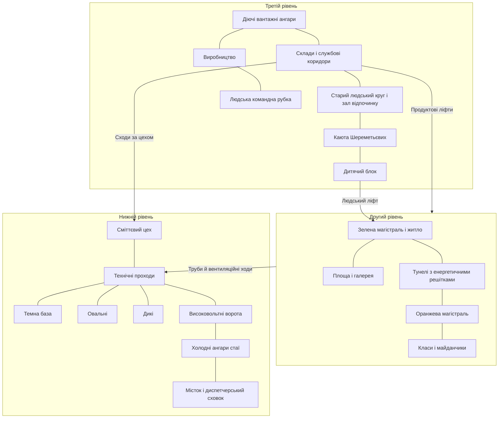
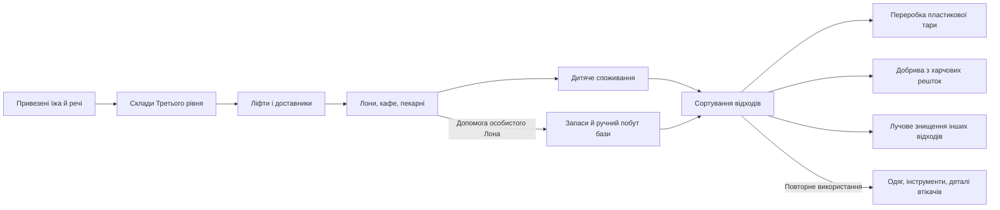
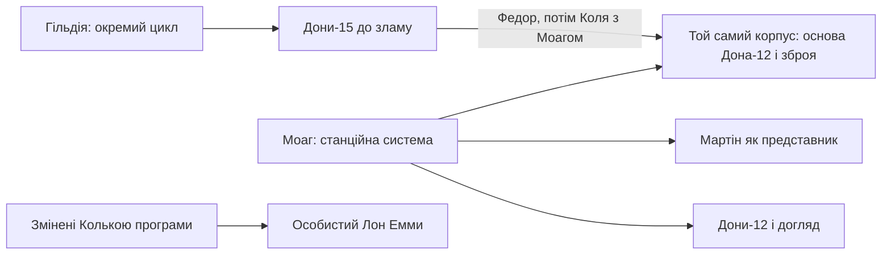

# Візуальна й звукова розробка

[Головна](../README.md) · [Уся біблія](README.md) · [Історія](Story.md) · [Персонажі](Characters.md) · [Світ](World.md) · [Технології](Technology/README.md)

## Зміст документа

- [Стиль і візуальні ідентифікатори](Visual_Development.md#%D1%81%D1%82%D0%B8%D0%BB%D1%8C-%D1%96-%D0%B2%D1%96%D0%B7%D1%83%D0%B0%D0%BB%D1%8C%D0%BD%D1%96-%D1%96%D0%B4%D0%B5%D0%BD%D1%82%D0%B8%D1%84%D1%96%D0%BA%D0%B0%D1%82%D0%BE%D1%80%D0%B8)
  - [Опори з тексту](Visual_Development.md#%D0%BE%D0%BF%D0%BE%D1%80%D0%B8-%D0%B7-%D1%82%D0%B5%D0%BA%D1%81%D1%82%D1%83)
  - [Три знаки, які не можна зливати](Visual_Development.md#%D1%82%D1%80%D0%B8-%D0%B7%D0%BD%D0%B0%D0%BA%D0%B8-%D1%8F%D0%BA%D1%96-%D0%BD%D0%B5-%D0%BC%D0%BE%D0%B6%D0%BD%D0%B0-%D0%B7%D0%BB%D0%B8%D0%B2%D0%B0%D1%82%D0%B8)
  - [Орієнтири кольору](Visual_Development.md#%D0%BE%D1%80%D1%96%D1%94%D0%BD%D1%82%D0%B8%D1%80%D0%B8-%D0%BA%D0%BE%D0%BB%D1%8C%D0%BE%D1%80%D1%83)
  - [Робоче творче питання](Visual_Development.md#%D1%80%D0%BE%D0%B1%D0%BE%D1%87%D0%B5-%D1%82%D0%B2%D0%BE%D1%80%D1%87%D0%B5-%D0%BF%D0%B8%D1%82%D0%B0%D0%BD%D0%BD%D1%8F)
  - [Точні деталі замість довільної палітри](Visual_Development.md#%D1%82%D0%BE%D1%87%D0%BD%D1%96-%D0%B4%D0%B5%D1%82%D0%B0%D0%BB%D1%96-%D0%B7%D0%B0%D0%BC%D1%96%D1%81%D1%82%D1%8C-%D0%B4%D0%BE%D0%B2%D1%96%D0%BB%D1%8C%D0%BD%D0%BE%D1%97-%D0%BF%D0%B0%D0%BB%D1%96%D1%82%D1%80%D0%B8)
- [Як зібрати з описів цілісний дизайн](Visual_Development.md#%D1%8F%D0%BA-%D0%B7%D1%96%D0%B1%D1%80%D0%B0%D1%82%D0%B8-%D0%B7-%D0%BE%D0%BF%D0%B8%D1%81%D1%96%D0%B2-%D1%86%D1%96%D0%BB%D1%96%D1%81%D0%BD%D0%B8%D0%B9-%D0%B4%D0%B8%D0%B7%D0%B0%D0%B9%D0%BD)
  - [Що об’єднує середовище](Visual_Development.md#%D1%89%D0%BE-%D0%BE%D0%B1%D1%94%D0%B4%D0%BD%D1%83%D1%94-%D1%81%D0%B5%D1%80%D0%B5%D0%B4%D0%BE%D0%B2%D0%B8%D1%89%D0%B5)
  - [Шість середовищ і їхня предметна логіка](Visual_Development.md#%D1%88%D1%96%D1%81%D1%82%D1%8C-%D1%81%D0%B5%D1%80%D0%B5%D0%B4%D0%BE%D0%B2%D0%B8%D1%89-%D1%96-%D1%97%D1%85%D0%BD%D1%8F-%D0%BF%D1%80%D0%B5%D0%B4%D0%BC%D0%B5%D1%82%D0%BD%D0%B0-%D0%BB%D0%BE%D0%B3%D1%96%D0%BA%D0%B0)
  - [Архітектура має витримувати дію](Visual_Development.md#%D0%B0%D1%80%D1%85%D1%96%D1%82%D0%B5%D0%BA%D1%82%D1%83%D1%80%D0%B0-%D0%BC%D0%B0%D1%94-%D0%B2%D0%B8%D1%82%D1%80%D0%B8%D0%BC%D1%83%D0%B2%D0%B0%D1%82%D0%B8-%D0%B4%D1%96%D1%8E)
  - [Екстер’єр: від чого відштовхуватися](Visual_Development.md#%D0%B5%D0%BA%D1%81%D1%82%D0%B5%D1%80%D1%94%D1%80-%D0%B2%D1%96%D0%B4-%D1%87%D0%BE%D0%B3%D0%BE-%D0%B2%D1%96%D0%B4%D1%88%D1%82%D0%BE%D0%B2%D1%85%D1%83%D0%B2%D0%B0%D1%82%D0%B8%D1%81%D1%8F)
  - [Одна матеріальна система — різні режими користування](Visual_Development.md#%D0%BE%D0%B4%D0%BD%D0%B0-%D0%BC%D0%B0%D1%82%D0%B5%D1%80%D1%96%D0%B0%D0%BB%D1%8C%D0%BD%D0%B0-%D1%81%D0%B8%D1%81%D1%82%D0%B5%D0%BC%D0%B0--%D1%80%D1%96%D0%B7%D0%BD%D1%96-%D1%80%D0%B5%D0%B6%D0%B8%D0%BC%D0%B8-%D0%BA%D0%BE%D1%80%D0%B8%D1%81%D1%82%D1%83%D0%B2%D0%B0%D0%BD%D0%BD%D1%8F)
  - [Роботи: відмінність має працювати в силуеті й дії](Visual_Development.md#%D1%80%D0%BE%D0%B1%D0%BE%D1%82%D0%B8-%D0%B2%D1%96%D0%B4%D0%BC%D1%96%D0%BD%D0%BD%D1%96%D1%81%D1%82%D1%8C-%D0%BC%D0%B0%D1%94-%D0%BF%D1%80%D0%B0%D1%86%D1%8E%D0%B2%D0%B0%D1%82%D0%B8-%D0%B2-%D1%81%D0%B8%D0%BB%D1%83%D0%B5%D1%82%D1%96-%D0%B9-%D0%B4%D1%96%D1%97)
  - [Колір має локальне значення](Visual_Development.md#%D0%BA%D0%BE%D0%BB%D1%96%D1%80-%D0%BC%D0%B0%D1%94-%D0%BB%D0%BE%D0%BA%D0%B0%D0%BB%D1%8C%D0%BD%D0%B5-%D0%B7%D0%BD%D0%B0%D1%87%D0%B5%D0%BD%D0%BD%D1%8F)
  - [Деталі, які вже дають осмислену сцену](Visual_Development.md#%D0%B4%D0%B5%D1%82%D0%B0%D0%BB%D1%96-%D1%8F%D0%BA%D1%96-%D0%B2%D0%B6%D0%B5-%D0%B4%D0%B0%D1%8E%D1%82%D1%8C-%D0%BE%D1%81%D0%BC%D0%B8%D1%81%D0%BB%D0%B5%D0%BD%D1%83-%D1%81%D1%86%D0%B5%D0%BD%D1%83)
  - [Чого не слід втратити під час стилізації](Visual_Development.md#%D1%87%D0%BE%D0%B3%D0%BE-%D0%BD%D0%B5-%D1%81%D0%BB%D1%96%D0%B4-%D0%B2%D1%82%D1%80%D0%B0%D1%82%D0%B8%D1%82%D0%B8-%D0%BF%D1%96%D0%B4-%D1%87%D0%B0%D1%81-%D1%81%D1%82%D0%B8%D0%BB%D1%96%D0%B7%D0%B0%D1%86%D1%96%D1%97)
- [Принципи подачі світу](Visual_Development.md#%D0%BF%D1%80%D0%B8%D0%BD%D1%86%D0%B8%D0%BF%D0%B8-%D0%BF%D0%BE%D0%B4%D0%B0%D1%87%D1%96-%D1%81%D0%B2%D1%96%D1%82%D1%83)
- [Звукова основа світу](Visual_Development.md#%D0%B7%D0%B2%D1%83%D0%BA%D0%BE%D0%B2%D0%B0-%D0%BE%D1%81%D0%BD%D0%BE%D0%B2%D0%B0-%D1%81%D0%B2%D1%96%D1%82%D1%83)
  - [Розкриття через звук](Visual_Development.md#%D1%80%D0%BE%D0%B7%D0%BA%D1%80%D0%B8%D1%82%D1%82%D1%8F-%D1%87%D0%B5%D1%80%D0%B5%D0%B7-%D0%B7%D0%B2%D1%83%D0%BA)
- [Концепти, які перевіряють розуміння світу](Visual_Development.md#%D0%BA%D0%BE%D0%BD%D1%86%D0%B5%D0%BF%D1%82%D0%B8-%D1%8F%D0%BA%D1%96-%D0%BF%D0%B5%D1%80%D0%B5%D0%B2%D1%96%D1%80%D1%8F%D1%8E%D1%82%D1%8C-%D1%80%D0%BE%D0%B7%D1%83%D0%BC%D1%96%D0%BD%D0%BD%D1%8F-%D1%81%D0%B2%D1%96%D1%82%D1%83)
  - [Перша серія: основа, яка визначає решту](Visual_Development.md#%D0%BF%D0%B5%D1%80%D1%88%D0%B0-%D1%81%D0%B5%D1%80%D1%96%D1%8F-%D0%BE%D1%81%D0%BD%D0%BE%D0%B2%D0%B0-%D1%8F%D0%BA%D0%B0-%D0%B2%D0%B8%D0%B7%D0%BD%D0%B0%D1%87%D0%B0%D1%94-%D1%80%D0%B5%D1%88%D1%82%D1%83)
  - [Друга серія: локації з робочими станами](Visual_Development.md#%D0%B4%D1%80%D1%83%D0%B3%D0%B0-%D1%81%D0%B5%D1%80%D1%96%D1%8F-%D0%BB%D0%BE%D0%BA%D0%B0%D1%86%D1%96%D1%97-%D0%B7-%D1%80%D0%BE%D0%B1%D0%BE%D1%87%D0%B8%D0%BC%D0%B8-%D1%81%D1%82%D0%B0%D0%BD%D0%B0%D0%BC%D0%B8)
  - [Третя серія: дизайн, який потребує окремого вибору](Visual_Development.md#%D1%82%D1%80%D0%B5%D1%82%D1%8F-%D1%81%D0%B5%D1%80%D1%96%D1%8F-%D0%B4%D0%B8%D0%B7%D0%B0%D0%B9%D0%BD-%D1%8F%D0%BA%D0%B8%D0%B9-%D0%BF%D0%BE%D1%82%D1%80%D0%B5%D0%B1%D1%83%D1%94-%D0%BE%D0%BA%D1%80%D0%B5%D0%BC%D0%BE%D0%B3%D0%BE-%D0%B2%D0%B8%D0%B1%D0%BE%D1%80%D1%83)
  - [Одна робоча картка концепту](Visual_Development.md#%D0%BE%D0%B4%D0%BD%D0%B0-%D1%80%D0%BE%D0%B1%D0%BE%D1%87%D0%B0-%D0%BA%D0%B0%D1%80%D1%82%D0%BA%D0%B0-%D0%BA%D0%BE%D0%BD%D1%86%D0%B5%D0%BF%D1%82%D1%83)
  - [Короткі перевірки предметів](Visual_Development.md#%D0%BA%D0%BE%D1%80%D0%BE%D1%82%D0%BA%D1%96-%D0%BF%D0%B5%D1%80%D0%B5%D0%B2%D1%96%D1%80%D0%BA%D0%B8-%D0%BF%D1%80%D0%B5%D0%B4%D0%BC%D0%B5%D1%82%D1%96%D0%B2)
  - [Питання, які треба вирішити до деталізованого екстер’єру](Visual_Development.md#%D0%BF%D0%B8%D1%82%D0%B0%D0%BD%D0%BD%D1%8F-%D1%8F%D0%BA%D1%96-%D1%82%D1%80%D0%B5%D0%B1%D0%B0-%D0%B2%D0%B8%D1%80%D1%96%D1%88%D0%B8%D1%82%D0%B8-%D0%B4%D0%BE-%D0%B4%D0%B5%D1%82%D0%B0%D0%BB%D1%96%D0%B7%D0%BE%D0%B2%D0%B0%D0%BD%D0%BE%D0%B3%D0%BE-%D0%B5%D0%BA%D1%81%D1%82%D0%B5%D1%80%D1%94%D1%80%D1%83)
- [Технічний паспорт розробки](Visual_Development.md#%D1%82%D0%B5%D1%85%D0%BD%D1%96%D1%87%D0%BD%D0%B8%D0%B9-%D0%BF%D0%B0%D1%81%D0%BF%D0%BE%D1%80%D1%82-%D1%80%D0%BE%D0%B7%D1%80%D0%BE%D0%B1%D0%BA%D0%B8)
  - [Перед будь-яким виробничим тестом](Visual_Development.md#%D0%BF%D0%B5%D1%80%D0%B5%D0%B4-%D0%B1%D1%83%D0%B4%D1%8C-%D1%8F%D0%BA%D0%B8%D0%BC-%D0%B2%D0%B8%D1%80%D0%BE%D0%B1%D0%BD%D0%B8%D1%87%D0%B8%D0%BC-%D1%82%D0%B5%D1%81%D1%82%D0%BE%D0%BC)

---

<!-- import-start: Bible/Style.md -->
## Стиль і візуальні ідентифікатори

Це джерельна основа для відбору й візуальної розробки. Нові дизайни та зміни адаптації ще не затверджені. Готової палітри з числовими кольорами, набору шрифтів чи обраного стилю генерації ще немає.

### Опори з тексту

Другий рівень — м’яке гумове покриття, доглянуті рослини, теплі приміщення, чистий пластик, прозорі вітрини, побутові тканини. Нижній — відкритий метал, пил, холодні поручні, видимі кабелі, старі шви й саморобний ремонт. На Третьому рівні білий промисловий порядок сусідить із бежевими доріжками, панелями під дерево й застарілим людським інтер’єром. [с. 2, 6–13](../Sources/Extracted/S03_%D0%96%D0%98%D0%92%D0%AB%D0%95_%D0%9B%D0%BE%D0%BA%D0%B0%D1%86%D0%B8%D0%B8_%D0%B8_%D0%BC%D0%B0%D1%80%D1%88%D1%80%D1%83%D1%82%D1%8B.md); [с. 2, 5](../Sources/Extracted/S07_%D0%96%D0%98%D0%92%D0%AB%D0%95_%D0%A1%D0%B8%D0%BC%D0%B2%D0%BE%D0%BB%D0%B8%D0%BA%D0%B0_%D0%B8_%D0%B2%D0%B8%D0%B7%D1%83%D0%B0%D0%BB%D1%8C%D0%BD%D1%8B%D0%B5_%D0%B8%D0%B4%D0%B5%D0%BD%D1%82%D0%B8%D1%84%D0%B8%D0%BA%D0%B0%D1%82%D0%BE%D1%80%D1%8B.md).

Костюм має пояснювати життя: одяг дитячих розмірів зшивають для старших, тож лоскутна куртка Федора є наслідком економіки станції. Чистий одяг Емми й практичні зношені шари Таїс створюють видиму різницю між їхнім досвідом.

### Три знаки, які не можна зливати

| Знак | Опис у джерелі | Невизначене |
|---|---|---|
| Старий знак «Млечного пути» | Квадрат із двох з’єднаних трикутників; двері, тканини, бойлер, стара форма | Точна геометрія, пропорції, товщина, початкові кольори |
| Новий герб | Сузір’я Гончих Псів; зірки з тонкими з’єднаннями, золотий церемоніальний мотив | Остаточне графічне креслення й система використання |
| Емблема Моага | Є на спортивній футболці й брелоку | Форма не описана; не тотожна автоматично першим двом |

На дверях ангарів нові золоті зірки фізично накладені поверх старого знака. Це предметний слід зміни порядку. Код М.О.X.I / М.О.X.И та його зв’язок з ім’ям Моага потребують мовного рішення, особливо якщо повертається Eden. [с. 1–3](../Sources/Extracted/S07_%D0%96%D0%98%D0%92%D0%AB%D0%95_%D0%A1%D0%B8%D0%BC%D0%B2%D0%BE%D0%BB%D0%B8%D0%BA%D0%B0_%D0%B8_%D0%B2%D0%B8%D0%B7%D1%83%D0%B0%D0%BB%D1%8C%D0%BD%D1%8B%D0%B5_%D0%B8%D0%B4%D0%B5%D0%BD%D1%82%D0%B8%D1%84%D0%B8%D0%BA%D0%B0%D1%82%D0%BE%D1%80%D1%8B.md).

### Орієнтири кольору

Зелена магістраль — смарагдове покриття; помаранчева — транспорт і торгівля. Церемоніальний екран — яскраво-синій із золотими зірками; медичний сканер має м’яке жовте світло й голубий індикатор; біометричний ліфт — жовту підсвітку кнопок. Єдиного значення кожного кольору для всіх пристроїв текст не задає.

### Робоче творче питання

Як зберегти предметну достовірність і ретроформи, обговорені командою, та уникнути безликого «білого майбутнього»? Для цього потрібне порівняння кількох концептів одного й того самого героя, робота й кімнати. Ступінь стилізації має бути вибраний командою до серійних модельних листів.

Розмова про R2-D2, сайлонів та інші відсилання лишилася дискусією. Жоден чужий дизайн не зафіксовано як прийнятий референс для копіювання. [TG-1133916](../Sources/Not_Included.md#outside-4a6a0b3657)–[TG-1133925](../Sources/Not_Included.md#outside-f3c04f1555).

### Точні деталі замість довільної палітри

| Носій | Зафіксований вигляд |
|---|---|
| Теплова карта | Люди — червоні точки. Це вже є в S04; палітру решти елементів ще належить спроєктувати. [PDF, с. 75](../Sources/Novel.md#%D1%81%D1%82%D0%BE%D1%80%D1%96%D0%BD%D0%BA%D0%B0-075), [PDF, с. 96](../Sources/Novel.md#%D1%81%D1%82%D0%BE%D1%80%D1%96%D0%BD%D0%BA%D0%B0-096), [S04 P0109](../Sources/Citations/S04.md#p0109). |
| Спільна голограма | Три планшети в ряд, зелено-синє світіння; один керує. [PDF, с. 150](../Sources/Novel.md#%D1%81%D1%82%D0%BE%D1%80%D1%96%D0%BD%D0%BA%D0%B0-150). |
| Архів професора | Наукові папки блакитні → сині за датою; щоденник зелений; записи мови бузкові. На планшеті Таїс вибраний сигнал 16-2 винесено в зелений файл. [PDF, с. 440–441](../Sources/Novel.md#%D1%81%D1%82%D0%BE%D1%80%D1%96%D0%BD%D0%BA%D0%B0-440), [PDF, с. 441](../Sources/Novel.md#%D1%81%D1%82%D0%BE%D1%80%D1%96%D0%BD%D0%BA%D0%B0-441), [PDF, с. 443–444](../Sources/Novel.md#%D1%81%D1%82%D0%BE%D1%80%D1%96%D0%BD%D0%BA%D0%B0-443), [PDF, с. 512](../Sources/Novel.md#%D1%81%D1%82%D0%BE%D1%80%D1%96%D0%BD%D0%BA%D0%B0-512). |
| Напис Дитячого блоку | Жовта голограма з оранжевими літерами. [PDF, с. 296](../Sources/Novel.md#%D1%81%D1%82%D0%BE%D1%80%D1%96%D0%BD%D0%BA%D0%B0-296). |
| Лоскутна куртка Федора | Один рукав рожево-сірий, другий сіро-синій; чорні манжети/зав’язки. Який саме рукав правий чи лівий, не вказано. [PDF, с. 16](../Sources/Novel.md#%D1%81%D1%82%D0%BE%D1%80%D1%96%D0%BD%D0%BA%D0%B0-016). |
| Старий знак на конкретних речах | На наволочці — коричнева вишивка; перед ДНК-дверима — біла фарба на підлозі. Це локальні варіанти, не єдиний корпоративний колір. [PDF, с. 29](../Sources/Novel.md#%D1%81%D1%82%D0%BE%D1%80%D1%96%D0%BD%D0%BA%D0%B0-029), [PDF, с. 293](../Sources/Novel.md#%D1%81%D1%82%D0%BE%D1%80%D1%96%D0%BD%D0%BA%D0%B0-293). |

**Емблема архівної заставки:** роман окремо називає три трикутники, тоді як на дверях старий знак має два. Не переносити геометрію одного носія на інший без рішення: [PDF, с. 325](../Sources/Novel.md#%D1%81%D1%82%D0%BE%D1%80%D1%96%D0%BD%D0%BA%D0%B0-325), [PDF, с. 18](../Sources/Novel.md#%D1%81%D1%82%D0%BE%D1%80%D1%96%D0%BD%D0%BA%D0%B0-018).

**Кулон-сонечко:** опис кольорів справжнього жука в роздумах Емми не встановлює розфарбування самого кулона. Ланцюжок і чорний шнурок мають сюжетний порядок; пізня згадка ланцюжка суперечлива. [PDF, с. 36](../Sources/Novel.md#%D1%81%D1%82%D0%BE%D1%80%D1%96%D0%BD%D0%BA%D0%B0-036), [PDF, с. 172](../Sources/Novel.md#%D1%81%D1%82%D0%BE%D1%80%D1%96%D0%BD%D0%BA%D0%B0-172), [PDF, с. 286](../Sources/Novel.md#%D1%81%D1%82%D0%BE%D1%80%D1%96%D0%BD%D0%BA%D0%B0-286).

Різні відтінки очей Іллі, Єгора та деталей Федора зібрано в [N03–N05](../Decisions/Open_Questions.md#%D1%80%D0%BE%D0%BC%D0%B0%D0%BD-%D1%96-%D0%B1%D1%96%D0%B1%D0%BB%D1%96%D1%8F-%D0%BF%D0%BE%D0%B2%D0%BD%D0%B0-%D0%B7%D0%B2%D1%96%D1%80%D0%BA%D0%B0). До вибору дизайну не оголошувати один із них остаточним.

Матеріали, покоління техніки, система масштабу й перевірка форми дією: [логіка дизайну світу](Visual_Development.md#%D1%8F%D0%BA-%D0%B7%D1%96%D0%B1%D1%80%D0%B0%D1%82%D0%B8-%D0%B7-%D0%BE%D0%BF%D0%B8%D1%81%D1%96%D0%B2-%D1%86%D1%96%D0%BB%D1%96%D1%81%D0%BD%D0%B8%D0%B9-%D0%B4%D0%B8%D0%B7%D0%B0%D0%B9%D0%BD).
<!-- import-end: Bible/Style.md -->

<!-- import-start: Bible/Art_Direction/Design_System.md -->
## Як зібрати з описів цілісний дизайн

[Головний довідник](README.md#%D0%B0%D1%80%D1%82-%D0%B4%D0%B8%D1%80%D0%B5%D0%BA%D1%88%D0%BD-alive-%D0%BF%D1%80%D0%B5%D0%B4%D0%BC%D0%B5%D1%82%D0%BD%D0%B8%D0%B9-%D1%81%D0%B2%D1%96%D1%82-%D1%80%D0%BE%D0%BC%D0%B0%D0%BD%D1%83) · [Предметний покажчик](README.md#%D0%BF%D0%BE%D0%BA%D0%B0%D0%B6%D1%87%D0%B8%D0%BA-%D0%BA%D0%B0%D1%80%D1%82%D0%BE%D0%BA-%D0%B4%D0%B8%D0%B7%D0%B0%D0%B9%D0%BD%D1%83-%D1%81%D0%B2%D1%96%D1%82%D1%83)

Цей документ — інтерпретація для концептуальної роботи. Він виходить із роману, але не проголошує остаточної стилістики, інженерного креслення чи нових законів світу.

### Що об’єднує середовище

Станція забезпечує дітям житло, навчання, їжу, одяг, розваги й медицину, а виробництву — безперервний випуск. Герої бачать переважно зручну споживчу поверхню; втеча відкриває матеріальні системи, від яких ця зручність залежить. Арт-дирекшн може зробити цю різницю читабельною через конструкцію: той самий ресурс приходить у житло як готова чашка какао, а на базі вимагає води, нагріву, пакета порошку, чашки й миття. [PDF, с. 23](../Sources/Novel.md#%D1%81%D1%82%D0%BE%D1%80%D1%96%D0%BD%D0%BA%D0%B0-023), [PDF, с. 24](../Sources/Novel.md#%D1%81%D1%82%D0%BE%D1%80%D1%96%D0%BD%D0%BA%D0%B0-024), [PDF, с. 89](../Sources/Novel.md#%D1%81%D1%82%D0%BE%D1%80%D1%96%D0%BD%D0%BA%D0%B0-089), [PDF, с. 196](../Sources/Novel.md#%D1%81%D1%82%D0%BE%D1%80%D1%96%D0%BD%D0%BA%D0%B0-196), [PDF, с. 386](../Sources/Novel.md#%D1%81%D1%82%D0%BE%D1%80%D1%96%D0%BD%D0%BA%D0%B0-386).

Важлива не лише опозиція чистого й брудного. Є доглянутий дитячий простір, стерильне небезпечне обслуговування, збережений старий людський комфорт, працюючий промисловий цех, ручний побут втікачів і холодна зона катастрофи. Якщо кожен із них матиме власну функцію, матеріали почнуть пояснювати світ без довідкової репліки.

### Шість середовищ і їхня предметна логіка

| Середовище | Матеріальна основа роману | Що має читатися в концепті |
|---|---|---|
| Дитячий Другий | Тепла підлога, пружна гума, гладкий пластик, скло вітрин, дерева в кадках, дерев’яні речі, кольорові тканини | Повсякденна зручність, дитячий масштаб, контроль і постійний догляд |
| Діючий службовий Третій | Білий новий пластик, довгі проходи, сірі доріжки, автоматичні двері, бойові роботи | Порядок виробничої процедури, відкриті лінії спостереження, мало випадкового життя |
| Старе людське житло Третього | Панелі під дерево, декоративні світильники, світла штучна шкіра, матове скло, текстиль, справна вода | Відсутній господар і збережений спосіб людського користування |
| Технічні бази | Метал, видимі труби, ручні ремонти, старі ковдри, саморобна плита, загальний обігрівач | Перетворення залишкового простору на житло, економія ресурсу, спільна праця |
| Сміттєве виробництво | Конвеєр, залізні ящики, сортувальні захвати, упаковка, біла лучова піч | Реальна послідовність матеріальних потоків і місця людського ризику |
| Закриті ангари | Високий промисловий об’єм, рифлений метал, зламане світло, кістки, пил, холод | Давня катастрофа, утримання стаї, приховане укриття над небезпекою |

Опори: [PDF, с. 15](../Sources/Novel.md#%D1%81%D1%82%D0%BE%D1%80%D1%96%D0%BD%D0%BA%D0%B0-015), [PDF, с. 21](../Sources/Novel.md#%D1%81%D1%82%D0%BE%D1%80%D1%96%D0%BD%D0%BA%D0%B0-021), [PDF, с. 37](../Sources/Novel.md#%D1%81%D1%82%D0%BE%D1%80%D1%96%D0%BD%D0%BA%D0%B0-037), [PDF, с. 55](../Sources/Novel.md#%D1%81%D1%82%D0%BE%D1%80%D1%96%D0%BD%D0%BA%D0%B0-055), [PDF, с. 103](../Sources/Novel.md#%D1%81%D1%82%D0%BE%D1%80%D1%96%D0%BD%D0%BA%D0%B0-103), [PDF, с. 281](../Sources/Novel.md#%D1%81%D1%82%D0%BE%D1%80%D1%96%D0%BD%D0%BA%D0%B0-281), [PDF, с. 296](../Sources/Novel.md#%D1%81%D1%82%D0%BE%D1%80%D1%96%D0%BD%D0%BA%D0%B0-296), [PDF, с. 298–299](../Sources/Novel.md#%D1%81%D1%82%D0%BE%D1%80%D1%96%D0%BD%D0%BA%D0%B0-298), [PDF, с. 355](../Sources/Novel.md#%D1%81%D1%82%D0%BE%D1%80%D1%96%D0%BD%D0%BA%D0%B0-355), [PDF, с. 358](../Sources/Novel.md#%D1%81%D1%82%D0%BE%D1%80%D1%96%D0%BD%D0%BA%D0%B0-358).

### Архітектура має витримувати дію

У романі основні рівні й поверхи всередині одного рівня різні. Кругла площа з галереєю вже має власну висоту; високий ангар містить місток і диспетчерську. Проста схема «три тонкі однакові палуби» може не вмістити ці сцени. [PDF, с. 37](../Sources/Novel.md#%D1%81%D1%82%D0%BE%D1%80%D1%96%D0%BD%D0%BA%D0%B0-037), [PDF, с. 268](../Sources/Novel.md#%D1%81%D1%82%D0%BE%D1%80%D1%96%D0%BD%D0%BA%D0%B0-268), [PDF, с. 290](../Sources/Novel.md#%D1%81%D1%82%D0%BE%D1%80%D1%96%D0%BD%D0%BA%D0%B0-290), [PDF, с. 358](../Sources/Novel.md#%D1%81%D1%82%D0%BE%D1%80%D1%96%D0%BD%D0%BA%D0%B0-358).

Нижче — схема зв’язків, не готовий план або масштабний розріз. Стрілки означають описаний перехід; в різні моменти його доступність змінюється.

Необхідні перевірки концепту:

1. Чи може Таїс нести дошку й повний рюкзак у потрібному лазі? Чи Федор поміщається лише у ширшій трубній шахті фіналу? [PDF, с. 14](../Sources/Novel.md#%D1%81%D1%82%D0%BE%D1%80%D1%96%D0%BD%D0%BA%D0%B0-014), [PDF, с. 515](../Sources/Novel.md#%D1%81%D1%82%D0%BE%D1%80%D1%96%D0%BD%D0%BA%D0%B0-515), [PDF, с. 516](../Sources/Novel.md#%D1%81%D1%82%D0%BE%D1%80%D1%96%D0%BD%D0%BA%D0%B0-516).
2. Чи видно джерело кожного повороту й глухого кута, від яких залежить погоня? [PDF, с. 290](../Sources/Novel.md#%D1%81%D1%82%D0%BE%D1%80%D1%96%D0%BD%D0%BA%D0%B0-290), [PDF, с. 291–292](../Sources/Novel.md#%D1%81%D1%82%D0%BE%D1%80%D1%96%D0%BD%D0%BA%D0%B0-291).
3. Чи можна фізично підняти людину через дах ліфта, на місток та спустити пораненого тросом? [PDF, с. 113](../Sources/Novel.md#%D1%81%D1%82%D0%BE%D1%80%D1%96%D0%BD%D0%BA%D0%B0-113), [PDF, с. 358–359](../Sources/Novel.md#%D1%81%D1%82%D0%BE%D1%80%D1%96%D0%BD%D0%BA%D0%B0-358), [PDF, с. 520](../Sources/Novel.md#%D1%81%D1%82%D0%BE%D1%80%D1%96%D0%BD%D0%BA%D0%B0-520), [PDF, с. 532](../Sources/Novel.md#%D1%81%D1%82%D0%BE%D1%80%D1%96%D0%BD%D0%BA%D0%B0-532).
4. Чи видно заварений підхід до воріт і його пізніше відкриття? [PDF, с. 64](../Sources/Novel.md#%D1%81%D1%82%D0%BE%D1%80%D1%96%D0%BD%D0%BA%D0%B0-064), [PDF, с. 472](../Sources/Novel.md#%D1%81%D1%82%D0%BE%D1%80%D1%96%D0%BD%D0%BA%D0%B0-472).
5. Чи залишаються реальні проходи для контейнерів, Донов, нош і дітей після розміщення меблів? [PDF, с. 110](../Sources/Novel.md#%D1%81%D1%82%D0%BE%D1%80%D1%96%D0%BD%D0%BA%D0%B0-110), [PDF, с. 456](../Sources/Novel.md#%D1%81%D1%82%D0%BE%D1%80%D1%96%D0%BD%D0%BA%D0%B0-456), [PDF, с. 533](../Sources/Novel.md#%D1%81%D1%82%D0%BE%D1%80%D1%96%D0%BD%D0%BA%D0%B0-533).

### Екстер’єр: від чого відштовхуватися

Детальний екстер’єр доведеться створити. Роман не дає підстав назвати готовим каноном ані колесо, ані циліндр, ані багатосекційну платформу. Для порівняння можна зробити три **проєктні гіпотези**:

- Широкий компактний корпус із кільцевими обходами всередині: простіше звести маршрути, але потрібно обґрунтувати великі об’єми ангарів і напрямки вікон.
- Кільцевий житловий пояс із виразним виробничим вузлом: зрозуміла функціональна різниця, але слід перевірити, чи не виникають зайві довгі переходи, яких сцени не передбачають.
- Багатоярусний корпус із помітною старою нижньою вантажною частиною та діючою верхньою: історія перебудови читається зовні, але силует і система тяжіння потребують окремої логіки.

Це варіанти для ескізного пошуку, не рекомендація затвердити один із них. У кожному треба вмістити: три рівні з внутрішніми поверхами, вантажний обмін, ізольоване виробництво, старі нижні ангари, великі людські вікна й доступ до командної рубки. Енергетика, тепловідведення, антени та видимий захист — ще не описані авторкою функції для проєктування. [PDF, с. 93](../Sources/Novel.md#%D1%81%D1%82%D0%BE%D1%80%D1%96%D0%BD%D0%BA%D0%B0-093), [PDF, с. 225](../Sources/Novel.md#%D1%81%D1%82%D0%BE%D1%80%D1%96%D0%BD%D0%BA%D0%B0-225), [PDF, с. 281](../Sources/Novel.md#%D1%81%D1%82%D0%BE%D1%80%D1%96%D0%BD%D0%BA%D0%B0-281), [PDF, с. 337](../Sources/Novel.md#%D1%81%D1%82%D0%BE%D1%80%D1%96%D0%BD%D0%BA%D0%B0-337), [PDF, с. 532](../Sources/Novel.md#%D1%81%D1%82%D0%BE%D1%80%D1%96%D0%BD%D0%BA%D0%B0-532), [PDF, с. 537](../Sources/Novel.md#%D1%81%D1%82%D0%BE%D1%80%D1%96%D0%BD%D0%BA%D0%B0-537).

### Одна матеріальна система — різні режими користування

Схема показує описані матеріальні операції. Повний транспорт сміття з кожної кімнати до цеху не змальований; його конкретні шахти або візки ще треба спроєктувати. [PDF, с. 102](../Sources/Novel.md#%D1%81%D1%82%D0%BE%D1%80%D1%96%D0%BD%D0%BA%D0%B0-102), [PDF, с. 103](../Sources/Novel.md#%D1%81%D1%82%D0%BE%D1%80%D1%96%D0%BD%D0%BA%D0%B0-103), [PDF, с. 103](../Sources/Novel.md#%D1%81%D1%82%D0%BE%D1%80%D1%96%D0%BD%D0%BA%D0%B0-103), [PDF, с. 196](../Sources/Novel.md#%D1%81%D1%82%D0%BE%D1%80%D1%96%D0%BD%D0%BA%D0%B0-196), [PDF, с. 228](../Sources/Novel.md#%D1%81%D1%82%D0%BE%D1%80%D1%96%D0%BD%D0%BA%D0%B0-228).

### Роботи: відмінність має працювати в силуеті й дії

Лон — маневрений домашній помічник із колесами та обслуговуванням близько до дитини. Дон-12 — високий дбайливий андроїд із м’якими пальцями. Дон-15 — нижчий важкий бойовий корпус із прозорими ногами й двома вбудованими стволами. Садівник — низький багаторукий інструментальний механізм. Пекар — квадратний міцний корпус для операцій із тістом. Ця функціональна відмінність важливіша за випадкове забарвлення. [PDF, с. 31–32](../Sources/Novel.md#%D1%81%D1%82%D0%BE%D1%80%D1%96%D0%BD%D0%BA%D0%B0-031), [PDF, с. 38–39](../Sources/Novel.md#%D1%81%D1%82%D0%BE%D1%80%D1%96%D0%BD%D0%BA%D0%B0-038), [PDF, с. 108](../Sources/Novel.md#%D1%81%D1%82%D0%BE%D1%80%D1%96%D0%BD%D0%BA%D0%B0-108), [PDF, с. 383](../Sources/Novel.md#%D1%81%D1%82%D0%BE%D1%80%D1%96%D0%BD%D0%BA%D0%B0-383), [PDF, с. 422](../Sources/Novel.md#%D1%81%D1%82%D0%BE%D1%80%D1%96%D0%BD%D0%BA%D0%B0-422), [PDF, с. 449](../Sources/Novel.md#%D1%81%D1%82%D0%BE%D1%80%D1%96%D0%BD%D0%BA%D0%B0-449).

Перепрограмований Дон-15 має лишитися тим самим роботом. Його нова дія — захист і медична евакуація — змінює наше прочитання корпусу. Для цього потрібні два поведінкові аркуші одного дизайну, а не дві майже різні моделі. [PDF, с. 461](../Sources/Novel.md#%D1%81%D1%82%D0%BE%D1%80%D1%96%D0%BD%D0%BA%D0%B0-461), [PDF, с. 533](../Sources/Novel.md#%D1%81%D1%82%D0%BE%D1%80%D1%96%D0%BD%D0%BA%D0%B0-533), [PDF, с. 534](../Sources/Novel.md#%D1%81%D1%82%D0%BE%D1%80%D1%96%D0%BD%D0%BA%D0%B0-534).

Схема — розподіл повноважень у сюжеті, не мережевий протокол і не місце серверів. [PDF, с. 305](../Sources/Novel.md#%D1%81%D1%82%D0%BE%D1%80%D1%96%D0%BD%D0%BA%D0%B0-305), [PDF, с. 406](../Sources/Novel.md#%D1%81%D1%82%D0%BE%D1%80%D1%96%D0%BD%D0%BA%D0%B0-406), [PDF, с. 407](../Sources/Novel.md#%D1%81%D1%82%D0%BE%D1%80%D1%96%D0%BD%D0%BA%D0%B0-407), [PDF, с. 460–461](../Sources/Novel.md#%D1%81%D1%82%D0%BE%D1%80%D1%96%D0%BD%D0%BA%D0%B0-460), [PDF, с. 534](../Sources/Novel.md#%D1%81%D1%82%D0%BE%D1%80%D1%96%D0%BD%D0%BA%D0%B0-534).

### Колір має локальне значення

Червона точка карти — людина; червона кнопка меча — випуск променя. Зелена дорога — простір, зелений файл — конкретний звуковий запуск, зелені кнопки — інша функція. Не треба силоміць надавати кожному кольору універсальне моральне значення. Жовте світло сканера, блакитний діод, оранжевий торговий екран і синьо-золота церемонія належать різним системам. [PDF, с. 75](../Sources/Novel.md#%D1%81%D1%82%D0%BE%D1%80%D1%96%D0%BD%D0%BA%D0%B0-075), [PDF, с. 116](../Sources/Novel.md#%D1%81%D1%82%D0%BE%D1%80%D1%96%D0%BD%D0%BA%D0%B0-116), [PDF, с. 38](../Sources/Novel.md#%D1%81%D1%82%D0%BE%D1%80%D1%96%D0%BD%D0%BA%D0%B0-038), [PDF, с. 42–43](../Sources/Novel.md#%D1%81%D1%82%D0%BE%D1%80%D1%96%D0%BD%D0%BA%D0%B0-042), [PDF, с. 375](../Sources/Novel.md#%D1%81%D1%82%D0%BE%D1%80%D1%96%D0%BD%D0%BA%D0%B0-375), [PDF, с. 512](../Sources/Novel.md#%D1%81%D1%82%D0%BE%D1%80%D1%96%D0%BD%D0%BA%D0%B0-512).

Палітру концептів можна звести до обмеженої кількості узгоджених матеріалів і світел, але точні коди кольорів будуть рішенням художника. Не підмінювати записану функцію кольору абстрактною схемою «синє — добре, червоне — зло».

### Деталі, які вже дають осмислену сцену

- Невідповідний розмір лоскутної куртки пояснює, чому немає дорослого забезпечення. [PDF, с. 16](../Sources/Novel.md#%D1%81%D1%82%D0%BE%D1%80%D1%96%D0%BD%D0%BA%D0%B0-016), [PDF, с. 16](../Sources/Novel.md#%D1%81%D1%82%D0%BE%D1%80%D1%96%D0%BD%D0%BA%D0%B0-016).
- Подряпаний палець не одразу запускає дошку; пристрій упізнає особу недосконало. [PDF, с. 9](../Sources/Novel.md#%D1%81%D1%82%D0%BE%D1%80%D1%96%D0%BD%D0%BA%D0%B0-009).
- Розсунуті двері спальні — частина опалення бази. [PDF, с. 30](../Sources/Novel.md#%D1%81%D1%82%D0%BE%D1%80%D1%96%D0%BD%D0%BA%D0%B0-030).
- Рожевий пластир, чашка з листям, килим із квітами й білий пухнастий малюк дають індивідуальну турботу всередині технічного середовища. [PDF, с. 193](../Sources/Novel.md#%D1%81%D1%82%D0%BE%D1%80%D1%96%D0%BD%D0%BA%D0%B0-193), [PDF, с. 244](../Sources/Novel.md#%D1%81%D1%82%D0%BE%D1%80%D1%96%D0%BD%D0%BA%D0%B0-244), [PDF, с. 501](../Sources/Novel.md#%D1%81%D1%82%D0%BE%D1%80%D1%96%D0%BD%D0%BA%D0%B0-501), [PDF, с. 520–521](../Sources/Novel.md#%D1%81%D1%82%D0%BE%D1%80%D1%96%D0%BD%D0%BA%D0%B0-520).
- Удосконалена голограма поруч із ручною мотузкою показує нерівномірність доступу до зручностей. [PDF, с. 150](../Sources/Novel.md#%D1%81%D1%82%D0%BE%D1%80%D1%96%D0%BD%D0%BA%D0%B0-150), [PDF, с. 520](../Sources/Novel.md#%D1%81%D1%82%D0%BE%D1%80%D1%96%D0%BD%D0%BA%D0%B0-520).
- Кулон, повідомлення й живе серце переозначують знайомий знак через конкретні стосунки. [PDF, с. 158](../Sources/Novel.md#%D1%81%D1%82%D0%BE%D1%80%D1%96%D0%BD%D0%BA%D0%B0-158), [PDF, с. 337](../Sources/Novel.md#%D1%81%D1%82%D0%BE%D1%80%D1%96%D0%BD%D0%BA%D0%B0-337), [PDF, с. 527](../Sources/Novel.md#%D1%81%D1%82%D0%BE%D1%80%D1%96%D0%BD%D0%BA%D0%B0-527).

### Чого не слід втратити під час стилізації

Вірус не є доведеним поломанням комп’ютера, стая не є інопланетною армією, Моаг не має заданого окремого гуманоїдного тіла. Професорські таблетки не завершують лікування. Рита поліпшується до їх отримання. Вік і частина зовнішніх рис суперечливі; докладний просторовий план також потребує узгодження. Усе це вже зібрано в [аудиті](../Decisions/Open_Questions.md#%D1%80%D0%BE%D0%BC%D0%B0%D0%BD-%D1%96-%D0%B1%D1%96%D0%B1%D0%BB%D1%96%D1%8F-%D0%BF%D0%BE%D0%B2%D0%BD%D0%B0-%D0%B7%D0%B2%D1%96%D1%80%D0%BA%D0%B0).

Роман дозволяє різну міру стилізації, але для концепту потрібно щоразу відповісти: хто користується предметом, що він робить руками, звідки бере ресурс, що зношується, що відкривається, як це змінює сцену. Саме ці питання перетворюють декоративний образ на частину світу.
<!-- import-end: Bible/Art_Direction/Design_System.md -->

<!-- import-start: Bible/Direction.md -->
## Принципи подачі світу

Нижче — пропозиції за аналізом матеріалу. Режисерська концепція конкретного відео ще не обрана.

**Показувати світ через дію.** Нехай глядач бачить, як дошка впізнає палець, як героїна складає кермо й бере дошку під пахву перед вентиляцією, як їжу ділять на базі. Так властивість світу стає частиною зрозумілої сцени.

**Зберігати дві точки зору.** Для Емми порядок спочатку означає безпеку, для Таїс — загрозу. Те саме правило, робот або чистий коридор мають різний сенс залежно від того, хто дивиться.

**Тримати просторову причину.** Якщо герой уникає переслідувача завдяки вузькому проходу, різницю габаритів треба показати. Якщо двері відкрилися за кодом або ДНК, зрозумілий момент доступу важливіший за довільно ефектний інтерфейс.

**Пам’ятати про час у сюжеті.** Лон, Мартін і Дон-15 не зводяться до одного ставлення до дітей. Після зміни програм ті самі корпуси поводяться інакше. Глядачеві потрібні видимі підстави цієї зміни.

**Дозувати таємницю.** Для нової аудиторії починати можна з персонажа й дивного правила. Пояснення всієї катастрофи, вірусу й Гільдії залишати для контенту з відповідним рівнем розкриття.

Опора: [розбір історії](../Sources/Not_Included.md#outside-e040303bb5), [просторові маршрути](../Sources/Extracted/S03_%D0%96%D0%98%D0%92%D0%AB%D0%95_%D0%9B%D0%BE%D0%BA%D0%B0%D1%86%D0%B8%D0%B8_%D0%B8_%D0%BC%D0%B0%D1%80%D1%88%D1%80%D1%83%D1%82%D1%8B.md), [поведінка персонажів](../Sources/Extracted/S05_%D0%96%D0%98%D0%92%D0%AB%D0%95_%D0%9F%D0%B5%D1%80%D1%81%D0%BE%D0%BD%D0%B0%D0%B6%D0%B8_%D0%B8_%D1%80%D0%BE%D0%B1%D0%BE%D1%82%D1%8B.md). Конкретні камера, ритм, звук і набір планів визначаються після вибору формату та сценарію.

**Показувати зміну переконань із причинами.** Емма спершу приймає рятівників на тепловій карті за службовців; пізніше впізнає помилку. Федор спершу шукає комп’ютерний вірус; архів розкриває біологічну інфекцію й навмисні програми Гільдії. Ці твердження не повинні звучати як одночасна всезнаюча розповідь. [PDF, с. 132](../Sources/Novel.md#%D1%81%D1%82%D0%BE%D1%80%D1%96%D0%BD%D0%BA%D0%B0-132), [PDF, с. 221](../Sources/Novel.md#%D1%81%D1%82%D0%BE%D1%80%D1%96%D0%BD%D0%BA%D0%B0-221), [PDF, с. 141–142](../Sources/Novel.md#%D1%81%D1%82%D0%BE%D1%80%D1%96%D0%BD%D0%BA%D0%B0-141), [PDF, с. 338–339](../Sources/Novel.md#%D1%81%D1%82%D0%BE%D1%80%D1%96%D0%BD%D0%BA%D0%B0-338).

**Розрізняти порятунок і згоду.** Емму виводять силою, вона ще не довіряє групі. Згодом довіру створюють конкретні вчинки: лікування, їжа, порятунок від Кренделя, підтримка після втрат. Не заміняти цей розвиток миттєвою дружбою. [PDF, с. 176](../Sources/Novel.md#%D1%81%D1%82%D0%BE%D1%80%D1%96%D0%BD%D0%BA%D0%B0-176), [PDF, с. 192](../Sources/Novel.md#%D1%81%D1%82%D0%BE%D1%80%D1%96%D0%BD%D0%BA%D0%B0-192), [PDF, с. 273](../Sources/Novel.md#%D1%81%D1%82%D0%BE%D1%80%D1%96%D0%BD%D0%BA%D0%B0-273).

Опори сцен: [послідовність](Story.md#%D0%BF%D0%BE%D1%81%D0%BB%D1%96%D0%B4%D0%BE%D0%B2%D0%BD%D1%96%D1%81%D1%82%D1%8C-%D0%BF%D0%BE%D0%B4%D1%96%D0%B9-%D1%96-%D1%80%D0%BE%D0%B7%D0%BA%D1%80%D0%B8%D1%82%D1%82%D1%96%D0%B2) та [стани](Story.md#%D1%81%D1%82%D0%B0%D0%BD%D0%B8-%D0%B3%D0%B5%D1%80%D0%BE%D1%97%D0%B2-%D0%BF%D1%80%D0%B5%D0%B4%D0%BC%D0%B5%D1%82%D1%96%D0%B2-%D1%96-%D0%B2%D1%82%D1%80%D0%B0%D1%82).
<!-- import-end: Bible/Direction.md -->

<!-- import-start: Bible/Sound.md -->
## Звукова основа світу

Це джерельна основа для відбору й візуальної розробки. Нові дизайни та зміни адаптації ще не затверджені.

| Мотив | Джерельна опора | Для чого він потрібний |
|---|---|---|
| Механіка станції | Вентиляція, конвеєри, колеса, двері, прилади | Відчуття працюючого середовища |
| Домашній Лон | Жарти, підсвистування, посуд, колеса | Практична турбота й характер |
| Офіційна церемонія | Повільний урочистий гімн із синім екраном і зірками | Обіцянка престижного дорослого майбутнього |
| «Пісня корабля» | Спершу загадковий виття / гул, згодом стая | Зміна значення того самого звуку після розкриття |
| Серцебиття | Синтетичний ритм у Дитячому блоці й живе серце людини | Тема близькості, походження й справжньої турботи |
| Записи професора | Ультразвукові сигнали, адаптер у чутний діапазон | Звук як дієвий сюжетний інструмент |
| Старі записи | Голоси людей, локальні екрани, культурний архів | Присутність зниклого людського минулого |

Джерела: [с. 3, 7, 9–11](../Sources/Extracted/S03_%D0%96%D0%98%D0%92%D0%AB%D0%95_%D0%9B%D0%BE%D0%BA%D0%B0%D1%86%D0%B8%D0%B8_%D0%B8_%D0%BC%D0%B0%D1%80%D1%88%D1%80%D1%83%D1%82%D1%8B.md), [с. 6, 10](../Sources/Extracted/S06_%D0%96%D0%98%D0%92%D0%AB%D0%95_%D0%9F%D1%80%D0%B5%D0%B4%D0%BC%D0%B5%D1%82%D1%8B_%D0%B8_%D1%82%D0%B5%D1%85%D0%BD%D0%BE%D0%BB%D0%BE%D0%B3%D0%B8%D0%B8.md), [с. 12](../Sources/Extracted/S05_%D0%96%D0%98%D0%92%D0%AB%D0%95_%D0%9F%D0%B5%D1%80%D1%81%D0%BE%D0%BD%D0%B0%D0%B6%D0%B8_%D0%B8_%D1%80%D0%BE%D0%B1%D0%BE%D1%82%D1%8B.md), [роман](../Sources/ALIVE.pdf).

Голоси, мова озвучення, музична концепція, виконавці та інструменти не обрані. Пісенні й кінематографічні цитати в романі є його джерельним матеріалом; їх використання у відео потребує окремого рішення щодо конкретного твору й способу використання.

### Розкриття через звук

«Пісня корабля» спочатку долинає слабко й без пояснення; пізніше герої локалізують її за нижніми дверима; у стаї бачать безпосереднє джерело виття. Це одна лінія розкриття, а не три незалежні механічні ефекти. [PDF, с. 115](../Sources/Novel.md#%D1%81%D1%82%D0%BE%D1%80%D1%96%D0%BD%D0%BA%D0%B0-115), [PDF, с. 180–181](../Sources/Novel.md#%D1%81%D1%82%D0%BE%D1%80%D1%96%D0%BD%D0%BA%D0%B0-180), [PDF, с. 359](../Sources/Novel.md#%D1%81%D1%82%D0%BE%D1%80%D1%96%D0%BD%D0%BA%D0%B0-359).

За записами професора: рик — попередження/агресія; колективне виття — ритуал стаї; свист і короткі ультразвуки — спілкування. Сигнали небезпеки й їжі схожі. Для звичайного людського слуху запис майже нечутний без адаптера; Емма пізніше сприймає його безпосередньо. Частоти в герцах не задані. [PDF, с. 443](../Sources/Novel.md#%D1%81%D1%82%D0%BE%D1%80%D1%96%D0%BD%D0%BA%D0%B0-443), [PDF, с. 443](../Sources/Novel.md#%D1%81%D1%82%D0%BE%D1%80%D1%96%D0%BD%D0%BA%D0%B0-443), [PDF, с. 444](../Sources/Novel.md#%D1%81%D1%82%D0%BE%D1%80%D1%96%D0%BD%D0%BA%D0%B0-444), [PDF, с. 512](../Sources/Novel.md#%D1%81%D1%82%D0%BE%D1%80%D1%96%D0%BD%D0%BA%D0%B0-512).

Сигнал 16-2 не слід показувати перевіреним захистом до першого спостереженого відступу стаї перед входом Таїс. Попередній вихід Емми/Колі відбувався без тварин поруч. [PDF, с. 510](../Sources/Novel.md#%D1%81%D1%82%D0%BE%D1%80%D1%96%D0%BD%D0%BA%D0%B0-510), [PDF, с. 513](../Sources/Novel.md#%D1%81%D1%82%D0%BE%D1%80%D1%96%D0%BD%D0%BA%D0%B0-513).

У Дитячому блоці ритм штучно імітує материнське серце; у близьких сценах Таїс чує живе серце Федора. Механічний запис і тілесна присутність мають різну драматичну функцію. [PDF, с. 288](../Sources/Novel.md#%D1%81%D1%82%D0%BE%D1%80%D1%96%D0%BD%D0%BA%D0%B0-288), [PDF, с. 322](../Sources/Novel.md#%D1%81%D1%82%D0%BE%D1%80%D1%96%D0%BD%D0%BA%D0%B0-322), [PDF, с. 527](../Sources/Novel.md#%D1%81%D1%82%D0%BE%D1%80%D1%96%D0%BD%D0%BA%D0%B0-527).

Ультразвуковий зв’язок стаї й радіозв’язок навушників — окремі системи. На Нижньому зв’язок із Моагом зникає, але герої продовжують чути одне одного. [PDF, с. 469](../Sources/Novel.md#%D1%81%D1%82%D0%BE%D1%80%D1%96%D0%BD%D0%BA%D0%B0-469), [PDF, с. 471](../Sources/Novel.md#%D1%81%D1%82%D0%BE%D1%80%D1%96%D0%BD%D0%BA%D0%B0-471), [PDF, с. 472](../Sources/Novel.md#%D1%81%D1%82%D0%BE%D1%80%D1%96%D0%BD%D0%BA%D0%B0-472).
<!-- import-end: Bible/Sound.md -->

<!-- import-start: Bible/Art_Direction/Concept_Workbook.md -->
## Концепти, які перевіряють розуміння світу

[Головний довідник](README.md#%D0%B0%D1%80%D1%82-%D0%B4%D0%B8%D1%80%D0%B5%D0%BA%D1%88%D0%BD-alive-%D0%BF%D1%80%D0%B5%D0%B4%D0%BC%D0%B5%D1%82%D0%BD%D0%B8%D0%B9-%D1%81%D0%B2%D1%96%D1%82-%D1%80%D0%BE%D0%BC%D0%B0%D0%BD%D1%83) · [Загальна логіка дизайну](Visual_Development.md#%D1%8F%D0%BA-%D0%B7%D1%96%D0%B1%D1%80%D0%B0%D1%82%D0%B8-%D0%B7-%D0%BE%D0%BF%D0%B8%D1%81%D1%96%D0%B2-%D1%86%D1%96%D0%BB%D1%96%D1%81%D0%BD%D0%B8%D0%B9-%D0%B4%D0%B8%D0%B7%D0%B0%D0%B9%D0%BD)

Нижче — запропонований порядок дослідження. Це не затверджений обсяг виробництва й не новий кошторис. Його можна звузити під першу сцену, зберігши узгодженість усього світу.

### Перша серія: основа, яка визначає решту

| Концепт | Що підготувати | Яку невідомість він закриває |
|---|---|---|
| 1. Об’єм станції | Три різні грубі силуети; розріз рівнів; діючі й старі ангари, вікна | Як вмістити описані маршрути та об’єми в одному кораблі |
| 2. Просторовий перехід | Той самий шлях: житлова галерея → Зелена → тунель → Оранжева → технічний лаз | Де людина й робот змінюють швидкість, видимість і спосіб руху |
| 3. Родина роботів | Лон, Дон-12, Дон-15, садівник, пекар, прибиральник в одному масштабі | Як функція визначає пропорції, матеріал і інструмент |
| 4. Предмети в руках | Дошка, планшет, нейтфон, флешка, викрутка, навушник, рюкзак | Чи можна виконати описану дію й не втратити функцію предмета |
| 5. Матеріальні покоління | Одна панель, двері, чашка й екран у дитячому, старому людському та підземному станах | Що об’єднує світ і що змінилося через час та використання |

### Друга серія: локації з робочими станами

| Концепт | Необхідні види | Пряма дія з роману |
|---|---|---|
| Дім Емми й Лона | План, кухня/гостинна, комод і шафа, ванна з трьома пральними модулями | Лон лагодить ящик, готує, висуває щітку, показує карту |
| Площа й магістралі | Загальний із галереї, погляд дитини, нічне постачання, оборона | Повсякденний рух перетворюється на погоню та порятунок |
| Екзамен і нашивки | Кабінка, робочий стіл, офіційний екран, коробка форми, доріжка до ліфта | Особистий успіх переводиться в контрольований маршрут |
| Темна база | План/розріз, спільний стіл, обігрівач, спальня, ванна, комори | Висушити одяг, розділити їжу, обробити рану, сховати малюків |
| Сміттєвий цех | Потоки сортування, масштаб конвеєра, клешня, піч, вихід за цехом | Дістати деталь, зібрати зброю, пройти нагору |
| Старий людський круг | Зал із галереєю, Т-подібний закуток, каюта, задній вихід | Група розділяється, Федор відкриває ДНК-двері |
| Нижні ворота | Запаяний підхід, згорілий роз’єм, відкрита плата, відновлений прохід | Зміна напруги й повторне запечатування стаї |
| Ангар і сховок | Високий зал, місток, драбина, пультова, переобладнана лабораторія | Підняти двох дітей і дорослого; згодом пораненого на тросі |
| Медичні середовища | Сканер, стара аптечка, два типи кювезів, фінальний медпункт | Діагностика, догляд, вирощування, лікування |
| Командна рубка | Підхід від цехів, поріг, півколо пультів, вікно на Землю | Поранений Федор бере керування |

Для кожного середовища корисний **один і той самий ракурс у двох сюжетних станах**. Він перевіряє послідовність і дозволяє бачити справжню зміну матеріалу, а не випадковий редизайн між зображеннями.

### Третя серія: дизайн, який потребує окремого вибору

**Стая й Пушистик.** Людська вихідна постать → раннє перетворення → доросла істота → спляча/активна пластика; поруч дитинча зі спорідненою анатомією. Не всім хворим потрібна фінальна тваринна версія: Валек помирає до показаного повного перетворення.

**Старі архіви.** Плоский екран, голографічне відео, приватний нейтфон, кольорові дослідницькі файли; різний вік техніки й спосіб читання. Зв’язок фото з конкретними людьми не вигадувати.

**Екстер’єри.** Моаг, вантажний крейсер, човник евакуації, автономний кур’єр і навчальні образи Землі/Марса. Це найбільше поле нового дизайну, бо роман задає передусім функції.

**Костюм і знаки.** Дитячий гардероб, перешита доросла річ, стара форма, нашивки, кулон, накладені емблеми; спочатку узгодити суперечливі віки й ознаки облич, потім розвивати варіанти.

### Одна робоча картка концепту

| Поле | Що записати |
|---|---|
| Об’єкт і сюжетний момент | Що це й коли в романі ми його бачимо |
| Книжкова опора | Конкретні абзаци з тематичної картки |
| Функція | Хто користується, яке завдання виконує, що є результатом |
| Незмінні ознаки | Наприклад, непрозорий кювез, дві озброєні руки Дона-15, складне кермо |
| Конструкція | Основні об’єми, стики, шарніри, роз’єми, доступ для руки або ремонту |
| Матеріал і стан | Нове / використане / покинуте / відремонтоване / пошкоджене |
| Нове рішення художника | Габарити, колір, механізм або форма, яких роман не задає |
| Перевірка дією | Коротка послідовність, яка показує працездатність задуму |
| Зв’язок із сусідами | Які інші предмети й приміщення повинні залишатися сумісними |
| Питання до команди | Тільки те, що реально змінює наступний концепт |

Це робочий запис для осмисленого пошуку, а не вимога затверджувати кожну дрібницю до першого ескізу. Важливо, щоб новий внесок не загубився серед нібито дослівних фактів роману.

### Короткі перевірки предметів

- **Дошка:** запуск за пальцем → підняття керма → розгін/поворот → гальмування → складання керма → перенесення з рюкзаком.
- **Лон:** поворот у кухні → взяти чашку → відкрити бічну щітку → відкрити передню панель → показати карту дитині.
- **Дон-15:** людина стрибає на спину → дістає шийний роз’єм → рука зі зброєю притиснута вниз → робот завмирає → його тягнуть у ліфт.
- **Ворота:** кришка роз’єму → живлення/оплавок → підключення → код → рух стулок → повторне запечатування.
- **Кювез:** плід в окремому моніторі → підведення до корпусу → доступ робота → місце в загальному ряді; транспортний тип перевіряється окремо.
- **Архів:** знайти папку → відкрити запис → перейти за посиланням → скопіювати → запустити 16-2 голосом у польовій ситуації.
- **Сховок:** із підлоги ангара на місток → закрити двері → перенести людину на кушетку → дістатися води → спуститися з допомогою троса.

### Питання, які треба вирішити до деталізованого екстер’єру

Як у корпусі поєднані кільцеві маршрути й високі ангари? Де зовнішні вікна й чому Землю видно лише в певних сценах? Які типи кораблів заходять усередину, а які стикуються? Як обслужити виробництво, не проводячи вантаж через житло? Яка система підтримує тяжіння й енергетичні потреби? Як старі й нові частини відрізняються зовні? Які питання залишаємо поза першим форматом?

Відповідей у вигляді точних авторських креслень немає. Натомість довідник дає просторові й функціональні умови, за якими можна порівнювати варіанти без довільного додавання можливостей.
<!-- import-end: Bible/Art_Direction/Concept_Workbook.md -->

<!-- import-start: Bible/Tech.md -->
## Технічний паспорт розробки

| Параметр | Стан на 22.09.2026 |
|---|---|
| Тип роботи | Багатоформатна візуальна розробка IP |
| Основний текст | Перший роман «Мы можем жить среди людей» |
| Мова внутрішнього пакета | Українська; оригінали збережено своїми мовами |
| Переклад для аудиторії | Англійський переклад планується; затвердженої версії немає |
| Співвідношення сторін | Не зафіксоване для всього проєкту; визначається для кожного носія |
| Частота кадрів, роздільність, звук | Погодити для конкретного тесту / продукту |
| Image / video / voice моделі | Не вибрані остаточно |
| Прийняті візуальні референси | Не надані як затверджений пакет |
| Медіасховище і доступи | Потрібно погодити; поточний текстовий центр — ця папка SuperVault |
| Публікація | Відповідальний і платформа ще не визначені |

### Перед будь-яким виробничим тестом

Зафіксувати його мету, джерельну сцену, матеріали, формат, тривалість, мову, технічний вихід, допустимі витрати й того, хто приймає результат. Перевіряти повторюваність персонажів і простору, а також придатність до монтажу.

Зафіксований на 18.09 вибір AI не є вибором конкретної моделі чи підписки. Приклади Kling / Runway / Veo в бюджеті — попередній список. Точні тарифи й параметри звіряються під час окремого технічного розрахунку.

Пов’язані документи: [інфраструктура](../Sources/Not_Included.md#outside-99f5c161e7), [виробничий план](../Sources/Not_Included.md#outside-1ca28ed38c), [критерії поставки](../Sources/Not_Included.md#outside-bc27df4018).
<!-- import-end: Bible/Tech.md -->
