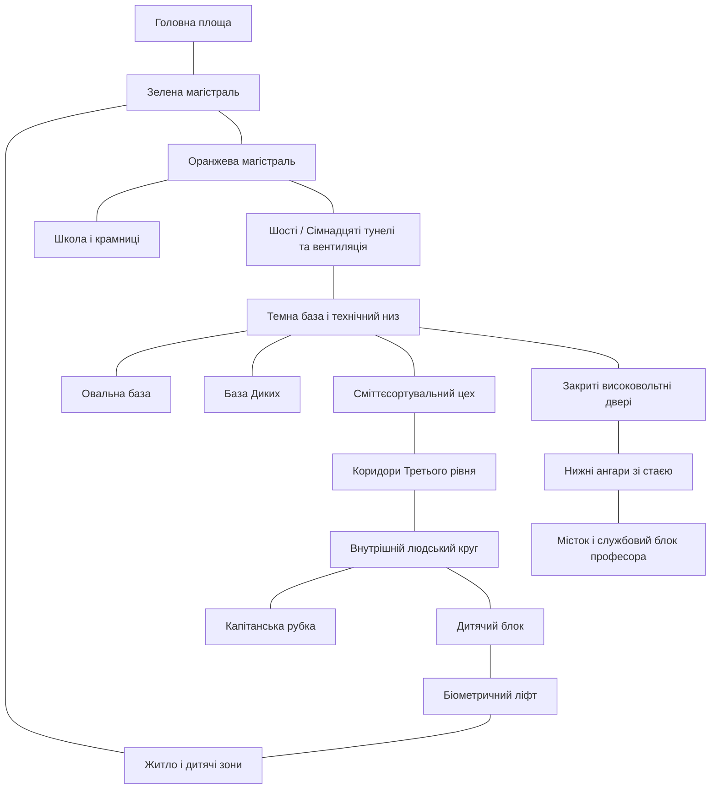

# Світ ALIVE: устрій, простір і правила

[Головна](../README.md) · [Уся біблія](README.md) · [Історія](Story.md) · [Персонажі](Characters.md) · [Технології](Technology/README.md) · [Розробка](Visual_Development.md)

Загальний опис світу й правила зібрано разом. Детальні простори: [Станція](Environments/Station.md) · [Другий рівень](Environments/Second_Level.md) · [Нижній рівень](Environments/Lower_Level.md) · [Третій рівень](Environments/Third_Level.md) · [Побут](Environments/Everyday_Life.md)

## Зміст документа

- [Станція і просторові зв’язки](World.md#%D1%81%D1%82%D0%B0%D0%BD%D1%86%D1%96%D1%8F-%D1%96-%D0%BF%D1%80%D0%BE%D1%81%D1%82%D0%BE%D1%80%D0%BE%D0%B2%D1%96-%D0%B7%D0%B2%D1%8F%D0%B7%D0%BA%D0%B8)
  - [Три рівні та приховані зони](World.md#%D1%82%D1%80%D0%B8-%D1%80%D1%96%D0%B2%D0%BD%D1%96-%D1%82%D0%B0-%D0%BF%D1%80%D0%B8%D1%85%D0%BE%D0%B2%D0%B0%D0%BD%D1%96-%D0%B7%D0%BE%D0%BD%D0%B8)
  - [Основні локації](World.md#%D0%BE%D1%81%D0%BD%D0%BE%D0%B2%D0%BD%D1%96-%D0%BB%D0%BE%D0%BA%D0%B0%D1%86%D1%96%D1%97)
  - [Каркас маршрутів](World.md#%D0%BA%D0%B0%D1%80%D0%BA%D0%B0%D1%81-%D0%BC%D0%B0%D1%80%D1%88%D1%80%D1%83%D1%82%D1%96%D0%B2)
  - [Стани в часі](World.md#%D1%81%D1%82%D0%B0%D0%BD%D0%B8-%D0%B2-%D1%87%D0%B0%D1%81%D1%96)
  - [Прив’язки для постановки](World.md#%D0%BF%D1%80%D0%B8%D0%B2%D1%8F%D0%B7%D0%BA%D0%B8-%D0%B4%D0%BB%D1%8F-%D0%BF%D0%BE%D1%81%D1%82%D0%B0%D0%BD%D0%BE%D0%B2%D0%BA%D0%B8)
- [Правила світу й поступове розкриття](World.md#%D0%BF%D1%80%D0%B0%D0%B2%D0%B8%D0%BB%D0%B0-%D1%81%D0%B2%D1%96%D1%82%D1%83-%D0%B9-%D0%BF%D0%BE%D1%81%D1%82%D1%83%D0%BF%D0%BE%D0%B2%D0%B5-%D1%80%D0%BE%D0%B7%D0%BA%D1%80%D0%B8%D1%82%D1%82%D1%8F)
  - [Хто чим керує](World.md#%D1%85%D1%82%D0%BE-%D1%87%D0%B8%D0%BC-%D0%BA%D0%B5%D1%80%D1%83%D1%94)
  - [Доступ і спостереження](World.md#%D0%B4%D0%BE%D1%81%D1%82%D1%83%D0%BF-%D1%96-%D1%81%D0%BF%D0%BE%D1%81%D1%82%D0%B5%D1%80%D0%B5%D0%B6%D0%B5%D0%BD%D0%BD%D1%8F)
  - [Вірус: що спостерігали і що припускають](World.md#%D0%B2%D1%96%D1%80%D1%83%D1%81-%D1%89%D0%BE-%D1%81%D0%BF%D0%BE%D1%81%D1%82%D0%B5%D1%80%D1%96%D0%B3%D0%B0%D0%BB%D0%B8-%D1%96-%D1%89%D0%BE-%D0%BF%D1%80%D0%B8%D0%BF%D1%83%D1%81%D0%BA%D0%B0%D1%8E%D1%82%D1%8C)
  - [Побут і знання](World.md#%D0%BF%D0%BE%D0%B1%D1%83%D1%82-%D1%96-%D0%B7%D0%BD%D0%B0%D0%BD%D0%BD%D1%8F)

---

<!-- import-start: Bible/World.md -->
## Станція і просторові зв’язки

Це джерельна основа для відбору й візуальної розробки. Нові дизайни та зміни адаптації ще не затверджені.

### Три рівні та приховані зони

| Зона | Призначення і вигляд | Що важливо для сцени |
|---|---|---|
| Другий рівень | Тепле, світле дитяче середовище; житлові блоки, школи, крамниці, садок | Догляд і контроль співіснують; речі мають виглядати придатними до повсякденного життя |
| Перший / Нижній технічний | Холодні старі виробничі, вентиляційні й службові простори; три бази | Доступ, габарити проходів, обігрів, обхідні маршрути й ремонт визначають дії |
| Третій рівень | Виробництво, службові зони, старий людський внутрішній круг, рубка | Білий діючий комплекс і тепліша за матеріалами стара людська частина різняться |
| Закриті нижні ангари | Темні зали, сліди катастрофи, стая, службовий блок професора | Високовольтні двері й холод утримували загрозу; відкриття змінює стан світу |

Фізичні рівні й списки людей у системі — окремі сутності. Запис у «списку Першого рівня» не дає поточного місцезнаходження людини. [P0295–0298](../Sources/Citations/S04.md#p0295).

### Основні локації

Другий рівень: Головна площа з рослинами й панеллю Закону; зелена пішохідна та помаранчева транспортна магістралі; кафе; школа й екзаменаційні кабінки; житловий блок Емми; бібліотека з вікном у космос; дитячі відділення; медпункт.

Нижній: Темна база з обігрівачем, бойлером, загальним побутом і меморіальною стіною; розписана Овальна база, що живе як сім’я; відокремлена база Диких; сміттєсортувальний цех; транспортний коридор із написом «Они здесь»; технічний вузол і вентиляція.

Третій: шлях випускника, Ізоляція, місце ін’єкцій і крематорій; склади; внутрішній людський круг і захищена каюта; Дитячий блок зі штучним вирощуванням; цехи й ангари; капітанська рубка з видом на Землю. Джерело: [атлас, с. 2–14](../Sources/Extracted/S03_%D0%96%D0%98%D0%92%D0%AB%D0%95_%D0%9B%D0%BE%D0%BA%D0%B0%D1%86%D0%B8%D0%B8_%D0%B8_%D0%BC%D0%B0%D1%80%D1%88%D1%80%D1%83%D1%82%D1%8B.md).

### Каркас маршрутів

Це топологічна схема зі словесних маршрутів, не затверджений план у масштабі. Умовний зв’язок не означає, що прохід постійно відкритий. Точні висоти, розміри, суміщення рівнів і зовнішній силует станції потребують проєктування.

### Стани в часі

Для кожної локації розрізняти: до катастрофи; початок роману; після появи Емми; після виходу стаї; після перехоплення керування. Постачання Темної бази через Лона, карантин і доступ героїв до Третього рівня змінюються в сюжеті. Зводити все це до одного «поточного» інтер’єру буде помилкою.

Шкільні відомості про Землю, політичний устрій, мови та стару історію — частина знань персонажів. Перед перенесенням у нову адаптацію їх слід відібрати окремо. [P0026–0045](../Sources/Citations/S04.md#p0026).

### Прив’язки для постановки

| Місце | Підтверджений зв’язок / вигляд |
|---|---|
| Вхід до баз | За спільними важкими дверима проходи до Овальної й Темної; це не одні двері одразу в спальню. Замок простий, трицифровий; замикають також задля тепла. [PDF, с. 18](../Sources/Novel.md#%D1%81%D1%82%D0%BE%D1%80%D1%96%D0%BD%D0%BA%D0%B0-018), [PDF, с. 218](../Sources/Novel.md#%D1%81%D1%82%D0%BE%D1%80%D1%96%D0%BD%D0%BA%D0%B0-218), [PDF, с. 262](../Sources/Novel.md#%D1%81%D1%82%D0%BE%D1%80%D1%96%D0%BD%D0%BA%D0%B0-262). |
| Вихід через сміттєвий цех | Кінець цеху біля печі → маленькі двері → вузький закуток → вертикальні сходи → квадратний люк → двері Третього. Під час різних походів відношення цього виходу до внутрішнього/зовнішнього кола описано не однаково; масштабне креслення не готове. [PDF, с. 104](../Sources/Novel.md#%D1%81%D1%82%D0%BE%D1%80%D1%96%D0%BD%D0%BA%D0%B0-104), [PDF, с. 104](../Sources/Novel.md#%D1%81%D1%82%D0%BE%D1%80%D1%96%D0%BD%D0%BA%D0%B0-104), [PDF, с. 106](../Sources/Novel.md#%D1%81%D1%82%D0%BE%D1%80%D1%96%D0%BD%D0%BA%D0%B0-106), [PDF, с. 281](../Sources/Novel.md#%D1%81%D1%82%D0%BE%D1%80%D1%96%D0%BD%D0%BA%D0%B0-281). |
| Кімнати затриманих | Таїс відрізняє кімнату біля зали ін’єкцій від Ізоляції на іншому боці рівня. Герої побутово називають утримання «ізоляцією»; не зливати всі приміщення в один універсальний ізолятор. [PDF, с. 96](../Sources/Novel.md#%D1%81%D1%82%D0%BE%D1%80%D1%96%D0%BD%D0%BA%D0%B0-096). |
| Людський внутрішній круг | Бежеві візерункові доріжки, дерево в облицюванні, скляні вставки, декоративні світильники; зал відпочинку з галереєю. Старі одинарні шлюзові двері опускаються вниз, захист кают окремо за ДНК. [PDF, с. 284](../Sources/Novel.md#%D1%81%D1%82%D0%BE%D1%80%D1%96%D0%BD%D0%BA%D0%B0-284), [PDF, с. 296](../Sources/Novel.md#%D1%81%D1%82%D0%BE%D1%80%D1%96%D0%BD%D0%BA%D0%B0-296), [PDF, с. 298–299](../Sources/Novel.md#%D1%81%D1%82%D0%BE%D1%80%D1%96%D0%BD%D0%BA%D0%B0-298). |
| Біометричний маршрут | З каюти Шереметьєвих за коморою є службові двері до Дитячого блоку; поряд прозорий ДНК-ліфт із білою підлогою. Середня кнопка спускає до Другого. [PDF, с. 378](../Sources/Novel.md#%D1%81%D1%82%D0%BE%D1%80%D1%96%D0%BD%D0%BA%D0%B0-378), [PDF, с. 379](../Sources/Novel.md#%D1%81%D1%82%D0%BE%D1%80%D1%96%D0%BD%D0%BA%D0%B0-379). |
| Нижні ангари | Спершу доступ через трубу до квадратного закутка. Перед останньою охотою Федор розпаює бічний прохід, тому стая й дошки проходять без труби. Після замикання він ховається в старій шахті для труб. [PDF, с. 64](../Sources/Novel.md#%D1%81%D1%82%D0%BE%D1%80%D1%96%D0%BD%D0%BA%D0%B0-064), [PDF, с. 472](../Sources/Novel.md#%D1%81%D1%82%D0%BE%D1%80%D1%96%D0%BD%D0%BA%D0%B0-472), [PDF, с. 516](../Sources/Novel.md#%D1%81%D1%82%D0%BE%D1%80%D1%96%D0%BD%D0%BA%D0%B0-516). |
| Професорський сховок | Місток із рухомим залишком драбини → двері → пультова шлюзу → друга кімната → переобладнана їдальня-лабораторія. Механіка води працює; холод зберігається. Приховане велике вікно за панеллю показує Землю. [PDF, с. 358–359](../Sources/Novel.md#%D1%81%D1%82%D0%BE%D1%80%D1%96%D0%BD%D0%BA%D0%B0-358), [PDF, с. 359](../Sources/Novel.md#%D1%81%D1%82%D0%BE%D1%80%D1%96%D0%BD%D0%BA%D0%B0-359), [PDF, с. 440](../Sources/Novel.md#%D1%81%D1%82%D0%BE%D1%80%D1%96%D0%BD%D0%BA%D0%B0-440), [PDF, с. 532](../Sources/Novel.md#%D1%81%D1%82%D0%BE%D1%80%D1%96%D0%BD%D0%BA%D0%B0-532). |
| Нова каюта Овальних | Після уникання сусідів живуть у теплому невеликому приміщенні: чотири зсунуті ліжка, жовто-оранжевий круглий килим, мальовані квіти/метелики, гіпсові фігурки. Не обов’язково той самий інтер’єр початкової Овальної бази. [PDF, с. 308](../Sources/Novel.md#%D1%81%D1%82%D0%BE%D1%80%D1%96%D0%BD%D0%BA%D0%B0-308), [PDF, с. 498–499](../Sources/Novel.md#%D1%81%D1%82%D0%BE%D1%80%D1%96%D0%BD%D0%BA%D0%B0-498), [PDF, с. 501](../Sources/Novel.md#%D1%81%D1%82%D0%BE%D1%80%D1%96%D0%BD%D0%BA%D0%B0-501). |
| Фінальна рубка | Навпроти виробничих цехів, через широкий коридор: короткі широкі білі сходи, сірі поручні, подвійні овальні двері. Півколо пультів, блакитні голограми, широке півкругле вікно на Землю. [PDF, с. 537](../Sources/Novel.md#%D1%81%D1%82%D0%BE%D1%80%D1%96%D0%BD%D0%BA%D0%B0-537), [PDF, с. 537](../Sources/Novel.md#%D1%81%D1%82%D0%BE%D1%80%D1%96%D0%BD%D0%BA%D0%B0-537). |

Високовольтні двері, звичайні кодові замки, ДНК-панелі та енергетичні решітки мають різні функції. Їх не слід замінювати однаковим ефектом «двері впізнали героя». Правила доступу: [система станції](World.md#%D0%BF%D1%80%D0%B0%D0%B2%D0%B8%D0%BB%D0%B0-%D1%81%D0%B2%D1%96%D1%82%D1%83-%D0%B9-%D0%BF%D0%BE%D1%81%D1%82%D1%83%D0%BF%D0%BE%D0%B2%D0%B5-%D1%80%D0%BE%D0%B7%D0%BA%D1%80%D0%B8%D1%82%D1%82%D1%8F).

Докладні архітектурні описи, екстер’єри, масштаби й умови для концептів: [арт-дирекційний довідник](README.md#%D0%B0%D1%80%D1%82-%D0%B4%D0%B8%D1%80%D0%B5%D0%BA%D1%88%D0%BD-alive-%D0%BF%D1%80%D0%B5%D0%B4%D0%BC%D0%B5%D1%82%D0%BD%D0%B8%D0%B9-%D1%81%D0%B2%D1%96%D1%82-%D1%80%D0%BE%D0%BC%D0%B0%D0%BD%D1%83).
<!-- import-end: Bible/World.md -->

<!-- import-start: Bible/World_Rules.md -->
## Правила світу й поступове розкриття

Внутрішній документ зі спойлерами всього роману. Для сцени важливо не лише «як усе влаштовано», а й що герої вже встигли дізнатися. Незведені суперечності — в [аудиті](../Decisions/Open_Questions.md#%D1%80%D0%BE%D0%BC%D0%B0%D0%BD-%D1%96-%D0%B1%D1%96%D0%B1%D0%BB%D1%96%D1%8F-%D0%BF%D0%BE%D0%B2%D0%BD%D0%B0-%D0%B7%D0%B2%D1%96%D1%80%D0%BA%D0%B0).

### Хто чим керує

| Система | Встановлено романом |
|---|---|
| Моаг | Підтримує станцію, виробництво й старі програми догляду за дітьми. Люди після катастрофи залишили автономний режим; пізніше прибулі роботи додали виробничий цикл і знищення випускників. [PDF, с. 336–337](../Sources/Novel.md#%D1%81%D1%82%D0%BE%D1%80%D1%96%D0%BD%D0%BA%D0%B0-336), [PDF, с. 338–339](../Sources/Novel.md#%D1%81%D1%82%D0%BE%D1%80%D1%96%D0%BD%D0%BA%D0%B0-338). |
| Мартін | Дон-12, через якого проявляється інтелект станції; сервер перебуває окремо. Знає правду про випускників, якої не знають звичайні Дони. Має доручення Андрія розкрити її Федору. [PDF, с. 405](../Sources/Novel.md#%D1%81%D1%82%D0%BE%D1%80%D1%96%D0%BD%D0%BA%D0%B0-405), [PDF, с. 406–407](../Sources/Novel.md#%D1%81%D1%82%D0%BE%D1%80%D1%96%D0%BD%D0%BA%D0%B0-406), [PDF, с. 407](../Sources/Novel.md#%D1%81%D1%82%D0%BE%D1%80%D1%96%D0%BD%D0%BA%D0%B0-407), [PDF, с. 408](../Sources/Novel.md#%D1%81%D1%82%D0%BE%D1%80%D1%96%D0%BD%D0%BA%D0%B0-408). |
| Дони-12 | Догляд, освіта, медицина, захист. Не можуть убивати навіть під час нападу стаї. Можуть утримувати її й відступати за енергетичні решітки. [PDF, с. 383](../Sources/Novel.md#%D1%81%D1%82%D0%BE%D1%80%D1%96%D0%BD%D0%BA%D0%B0-383), [PDF, с. 384](../Sources/Novel.md#%D1%81%D1%82%D0%BE%D1%80%D1%96%D0%BD%D0%BA%D0%B0-384). |
| Дони-15 до зламу | Власний цикл Гільдії; Мартін може викликати, але не керувати. Їхня поява на Другому небезпечна й для дітей. [PDF, с. 406](../Sources/Novel.md#%D1%81%D1%82%D0%BE%D1%80%D1%96%D0%BD%D0%BA%D0%B0-406), [PDF, с. 407](../Sources/Novel.md#%D1%81%D1%82%D0%BE%D1%80%D1%96%D0%BD%D0%BA%D0%B0-407). |
| Перепрошиті Дони-15 | Спочатку один: основа Дона-12, додаткові функції зброї, керування Моага. Потім Коля з Моагом змінюють усіх через сервер Донов. Корпус не змінюється. [PDF, с. 460–461](../Sources/Novel.md#%D1%81%D1%82%D0%BE%D1%80%D1%96%D0%BD%D0%BA%D0%B0-460), [PDF, с. 461](../Sources/Novel.md#%D1%81%D1%82%D0%BE%D1%80%D1%96%D0%BD%D0%BA%D0%B0-461), [PDF, с. 534](../Sources/Novel.md#%D1%81%D1%82%D0%BE%D1%80%D1%96%D0%BD%D0%BA%D0%B0-534). |
| Особистий Лон Емми | Доступ до мережі лишився, приймання команд Моага відключене після конфлікту Кольчиної програми з картою зв’язку. Пріоритет допомоги дозволяє спуститися до дітей на Нижній рівень. [PDF, с. 305](../Sources/Novel.md#%D1%81%D1%82%D0%BE%D1%80%D1%96%D0%BD%D0%BA%D0%B0-305), [PDF, с. 227](../Sources/Novel.md#%D1%81%D1%82%D0%BE%D1%80%D1%96%D0%BD%D0%BA%D0%B0-227). |

Шкільний випуск прив’язаний до 15 років, але пізніше Мартін називає діапазон наказу: старші п’ятнадцяти, молодші шістнадцяти. Федор і Таїс старші та переведені ним до безпечного списку; Мартін не може ними розпоряджатися. Це не підтверджує автоматичної безпеки кожного втікача після 16: статус у списках і окремі програми Донов-15 також мають значення. [PDF, с. 367](../Sources/Novel.md#%D1%81%D1%82%D0%BE%D1%80%D1%96%D0%BD%D0%BA%D0%B0-367), [PDF, с. 416](../Sources/Novel.md#%D1%81%D1%82%D0%BE%D1%80%D1%96%D0%BD%D0%BA%D0%B0-416).

### Доступ і спостереження

На початку втікачі користуються кодом Лона й прихованою флешкою у вузлі Другого рівня. Планшети маскуються як робот. Після отримання пам’яті Дона-15 з’являється ширший доступ; він не означає керування всією станцією. Код Лона має шість знаків, Дона-15 — п’ятнадцять. [PDF, с. 143](../Sources/Novel.md#%D1%81%D1%82%D0%BE%D1%80%D1%96%D0%BD%D0%BA%D0%B0-143), [PDF, с. 151](../Sources/Novel.md#%D1%81%D1%82%D0%BE%D1%80%D1%96%D0%BD%D0%BA%D0%B0-151), [PDF, с. 151](../Sources/Novel.md#%D1%81%D1%82%D0%BE%D1%80%D1%96%D0%BD%D0%BA%D0%B0-151), [PDF, с. 151](../Sources/Novel.md#%D1%81%D1%82%D0%BE%D1%80%D1%96%D0%BD%D0%BA%D0%B0-151), [PDF, с. 349](../Sources/Novel.md#%D1%81%D1%82%D0%BE%D1%80%D1%96%D0%BD%D0%BA%D0%B0-349).

Можна вимкнути обмежену кількість теплових датчиків. Надмірне вимкнення викликає тривогу й блокування дверей Другого та Третього рівнів. Є запуск із затримкою. Червоні точки позначають присутність людей, не повідомляють автоматично їхні імена. [PDF, с. 75](../Sources/Novel.md#%D1%81%D1%82%D0%BE%D1%80%D1%96%D0%BD%D0%BA%D0%B0-075), [PDF, с. 106](../Sources/Novel.md#%D1%81%D1%82%D0%BE%D1%80%D1%96%D0%BD%D0%BA%D0%B0-106), [PDF, с. 306](../Sources/Novel.md#%D1%81%D1%82%D0%BE%D1%80%D1%96%D0%BD%D0%BA%D0%B0-306).

Нижній рівень має прогалини спостереження та недоступні карти, але він фізично існує в системі. Деякі ліфти туди ходять; твердження «Моаг узагалі не знає про нього» — рання помилка героїв. Існує окремий список, у який система зараховує втікачів і змінених. [PDF, с. 153](../Sources/Novel.md#%D1%81%D1%82%D0%BE%D1%80%D1%96%D0%BD%D0%BA%D0%B0-153), [PDF, с. 227](../Sources/Novel.md#%D1%81%D1%82%D0%BE%D1%80%D1%96%D0%BD%D0%BA%D0%B0-227), [PDF, с. 367](../Sources/Novel.md#%D1%81%D1%82%D0%BE%D1%80%D1%96%D0%BD%D0%BA%D0%B0-367). Розташування маскувального пристрою і повнота карт суперечливі: N07–N08.

Старі ДНК-двері відкривають людські приміщення, не пускають роботів. Федора впізнають як Шереметьєва. Високовольтний замок нижніх ангарів — навмисна пастка для випадкового відкривання, створена людьми, а не доведений прояв «злості Моага». [PDF, с. 294](../Sources/Novel.md#%D1%81%D1%82%D0%BE%D1%80%D1%96%D0%BD%D0%BA%D0%B0-294), [PDF, с. 331](../Sources/Novel.md#%D1%81%D1%82%D0%BE%D1%80%D1%96%D0%BD%D0%BA%D0%B0-331), [PDF, с. 335](../Sources/Novel.md#%D1%81%D1%82%D0%BE%D1%80%D1%96%D0%BD%D0%BA%D0%B0-335).

### Вірус: що спостерігали і що припускають

**Носійство.** Вірус був у повітрі всіх трьох рівнів і в крові дітей ще під час первинної катастрофи. Роман прямо підтверджує носійство всіх дітей; точний момент зараження кожного героя не встановлено. Контакт із Дикими не є доведеним початком носійства. [PDF, с. 328–329](../Sources/Novel.md#%D1%81%D1%82%D0%BE%D1%80%D1%96%D0%BD%D0%BA%D0%B0-328), [PDF, с. 330](../Sources/Novel.md#%D1%81%D1%82%D0%BE%D1%80%D1%96%D0%BD%D0%BA%D0%B0-330), [PDF, с. 411](../Sources/Novel.md#%D1%81%D1%82%D0%BE%D1%80%D1%96%D0%BD%D0%BA%D0%B0-411).

**Активація.** У записі Андрія її пов’язують із гормонами та дозріванням; емоційні спалахи можуть передувати зовнішнім змінам. Варіанти перебігу різні: нудота, слабкість, температура, зміни очей і шкіри, втрата мовлення/пам’яті; можливі перетворення або смерть. Гнів сам собою не є достатньою ознакою: герої сердяться й через страх, втрати та несправедливість. [PDF, с. 327](../Sources/Novel.md#%D1%81%D1%82%D0%BE%D1%80%D1%96%D0%BD%D0%BA%D0%B0-327), [PDF, с. 328](../Sources/Novel.md#%D1%81%D1%82%D0%BE%D1%80%D1%96%D0%BD%D0%BA%D0%B0-328), [PDF, с. 334](../Sources/Novel.md#%D1%81%D1%82%D0%BE%D1%80%D1%96%D0%BD%D0%BA%D0%B0-334), [PDF, с. 341](../Sources/Novel.md#%D1%81%D1%82%D0%BE%D1%80%D1%96%D0%BD%D0%BA%D0%B0-341).

**Перетворення.** Сіра шкіра, темні очі, зниклі вії, зміна щелепи, надлюдські стрибки й регенерація. Нижче +15 °C, за спостереженням команди Андрія, активність падає до сплячки. Стая використовує запахи, свист та ультразвук; нападає групою, з’їдає слабких. [PDF, с. 330](../Sources/Novel.md#%D1%81%D1%82%D0%BE%D1%80%D1%96%D0%BD%D0%BA%D0%B0-330), [PDF, с. 332–333](../Sources/Novel.md#%D1%81%D1%82%D0%BE%D1%80%D1%96%D0%BD%D0%BA%D0%B0-332), [PDF, с. 443](../Sources/Novel.md#%D1%81%D1%82%D0%BE%D1%80%D1%96%D0%BD%D0%BA%D0%B0-443).

**Любов.** Андрій виявляє спільне у незмінених — міцні емоційні зв’язки, зокрема між партнерами та батьками й дітьми. Він прямо визнає незавершеність досліджень; Мартін також не має точних даних. Рита поліпшується під доглядом подруг до отримання професорських ліків. Це підтримує центральну ідею роману, але не встановлює повної формули імунітету. [PDF, с. 334](../Sources/Novel.md#%D1%81%D1%82%D0%BE%D1%80%D1%96%D0%BD%D0%BA%D0%B0-334), [PDF, с. 337](../Sources/Novel.md#%D1%81%D1%82%D0%BE%D1%80%D1%96%D0%BD%D0%BA%D0%B0-337), [PDF, с. 412](../Sources/Novel.md#%D1%81%D1%82%D0%BE%D1%80%D1%96%D0%BD%D0%BA%D0%B0-412), [PDF, с. 500](../Sources/Novel.md#%D1%81%D1%82%D0%BE%D1%80%D1%96%D0%BD%D0%BA%D0%B0-500).

Не зводити любов до статевих стосунків, взаємного романтичного кохання чи відсутності злості. Федор говорить також про пам’ять і любов до померлих. Заяви «моєї любові вистачить на двох» або «без тебе я теж змінюся» — його обіцянки й страхи. [PDF, с. 339–340](../Sources/Novel.md#%D1%81%D1%82%D0%BE%D1%80%D1%96%D0%BD%D0%BA%D0%B0-339), [PDF, с. 342](../Sources/Novel.md#%D1%81%D1%82%D0%BE%D1%80%D1%96%D0%BD%D0%BA%D0%B0-342), [PDF, с. 377](../Sources/Novel.md#%D1%81%D1%82%D0%BE%D1%80%D1%96%D0%BD%D0%BA%D0%B0-377), [PDF, с. 468](../Sources/Novel.md#%D1%81%D1%82%D0%BE%D1%80%D1%96%D0%BD%D0%BA%D0%B0-468).

**Препарати.** Звичайні антивірусні засоби й імунні модулі виявилися неефективними. Професорські таблетки з ендорфінами сповільнюють зміни; у Емми з’являються регенерація, посилені чуття й нічний зір. Незаразність — твердження професора, яке Коля переносить на себе й Емму; нового лабораторного підтвердження в цих сценах немає. [PDF, с. 328](../Sources/Novel.md#%D1%81%D1%82%D0%BE%D1%80%D1%96%D0%BD%D0%BA%D0%B0-328), [PDF, с. 395](../Sources/Novel.md#%D1%81%D1%82%D0%BE%D1%80%D1%96%D0%BD%D0%BA%D0%B0-395), [PDF, с. 399](../Sources/Novel.md#%D1%81%D1%82%D0%BE%D1%80%D1%96%D0%BD%D0%BA%D0%B0-399), [PDF, с. 434–435](../Sources/Novel.md#%D1%81%D1%82%D0%BE%D1%80%D1%96%D0%BD%D0%BA%D0%B0-434), [PDF, с. 445](../Sources/Novel.md#%D1%81%D1%82%D0%BE%D1%80%D1%96%D0%BD%D0%BA%D0%B0-445), [PDF, с. 494](../Sources/Novel.md#%D1%81%D1%82%D0%BE%D1%80%D1%96%D0%BD%D0%BA%D0%B0-494). Це правила фантастичного твору, не опис реальної терапії.

### Побут і знання

Базову форму видають безплатно; бонуси й електронні гроші не слід зливати в одну валюту з вигаданим курсом. Старші діти працюють із молодшими, щоб ті бачили людські обличчя й навчалися емоцій. На Нижньому малюки вже вміють програмувати, але Маша продовжує навчати письма, математики й історії. [PDF, с. 123](../Sources/Novel.md#%D1%81%D1%82%D0%BE%D1%80%D1%96%D0%BD%D0%BA%D0%B0-123), [PDF, с. 133–134](../Sources/Novel.md#%D1%81%D1%82%D0%BE%D1%80%D1%96%D0%BD%D0%BA%D0%B0-133), [PDF, с. 202](../Sources/Novel.md#%D1%81%D1%82%D0%BE%D1%80%D1%96%D0%BD%D0%BA%D0%B0-202), [PDF, с. 259](../Sources/Novel.md#%D1%81%D1%82%D0%BE%D1%80%D1%96%D0%BD%D0%BA%D0%B0-259).

На початку основний спосіб дістати їжу — вилазки; після повернення до Лона постачання стає регулярним. Емма пропонує облік, Маша видає порції; правила бази й її санкції не тотожні старому Закону Моага. [PDF, с. 196](../Sources/Novel.md#%D1%81%D1%82%D0%BE%D1%80%D1%96%D0%BD%D0%BA%D0%B0-196), [PDF, с. 201](../Sources/Novel.md#%D1%81%D1%82%D0%BE%D1%80%D1%96%D0%BD%D0%BA%D0%B0-201), [PDF, с. 231–232](../Sources/Novel.md#%D1%81%D1%82%D0%BE%D1%80%D1%96%D0%BD%D0%BA%D0%B0-231), [PDF, с. 247](../Sources/Novel.md#%D1%81%D1%82%D0%BE%D1%80%D1%96%D0%BD%D0%BA%D0%B0-247).

Шкільна історія Землі, умови роботи, право, сім’я й еволюція — засвоєна героями версія. Архіви показують примусове обмеження пересування, зачаття дітей без згоди батьків і евтаназію; ці історичні записи не підтверджують нинішнього стану всієї Землі. Фінал показує планету у вікно, але контакту з її людьми ще немає. [PDF, с. 482–483](../Sources/Novel.md#%D1%81%D1%82%D0%BE%D1%80%D1%96%D0%BD%D0%BA%D0%B0-482), [PDF, с. 483](../Sources/Novel.md#%D1%81%D1%82%D0%BE%D1%80%D1%96%D0%BD%D0%BA%D0%B0-483), [PDF, с. 485](../Sources/Novel.md#%D1%81%D1%82%D0%BE%D1%80%D1%96%D0%BD%D0%BA%D0%B0-485), [PDF, с. 532](../Sources/Novel.md#%D1%81%D1%82%D0%BE%D1%80%D1%96%D0%BD%D0%BA%D0%B0-532), [PDF, с. 538](../Sources/Novel.md#%D1%81%D1%82%D0%BE%D1%80%D1%96%D0%BD%D0%BA%D0%B0-538).
<!-- import-end: Bible/World_Rules.md -->
