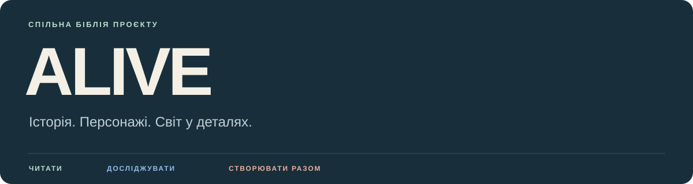

# ALIVE — спільна біблія

Історія, персонажі, середовища й правила їх відтворення. Єдине робоче місце для читання, творчих пропозицій і погоджених змін.

| Почати | Працювати | Підключити агента |
| :--- | :--- | :--- |
| **[Інструкція учаснику](START_HERE.md)** | **[Командний дашборд](TEAM_DASHBOARD.md)** | **[Повне встановлення](AGENT_SETUP.md)** |
| Акаунт, доступ і перше відкриття вікі | Тексти, правки, перегляд і рішення | Програми, Obsidian Git і перевірка готовності |

> [!NOTE]
> **Поточне літературне джерело — [ALIVE.pdf](Sources/ALIVE.pdf).** [Зміст роману](Sources/Novel_Index.md) веде до розділів, а [сторінковий витяг](Sources/Novel.md) допомагає агентам знаходити опори. Творчі пропозиції в біблії мають власний статус і потребують людського приймання.

## Біблія світу

**[Повна карта та покажчик 108 карток](Bible/README.md)**

| Розділ | Що всередині |
| :--- | :--- |
| **[01 · Історія](Bible/Story.md)** | Сюжет, хронологія, розкриття й стани героїв |
| **[02 · Персонажі](Bible/Characters.md)** | Люди й роботи як персонажі, зовнішність, одяг, особисті речі |
| **[03 · Світ](Bible/World.md)** | Просторовий устрій, керування, доступ, вірус і знання героїв |
| **[04 · Середовища](Bible/Environments/Station.md)** | Станція, її рівні, приміщення, побут і матеріали |
| **[05 · Технології](Bible/Technology/README.md)** | Роботи, транспорт, зброя, інтерфейси й медицина |
| **[06 · Візуальна розробка](Bible/Visual_Development.md)** | Стиль, система дизайну, режисура, звук і концепти |

**Приміщення за рівнями:** [Другий](Bible/Environments/Second_Level.md) · [Нижній](Bible/Environments/Lower_Level.md) · [Третій](Bible/Environments/Third_Level.md) · [Побут і матеріали](Bible/Environments/Everyday_Life.md)

## Писати руками в Obsidian

Перед новою правкою агент готує робочу гілку й ставить автооновлення на паузу. Далі автор:

1. Відкриває нотатку; **Ctrl+E / Cmd+E** перемикає її в редагування, якщо зараз увімкнено читання.
2. Пише текст — Obsidian зберігає його автоматично на комп’ютері.
3. Коли готово: **Ctrl+P / Cmd+P → Git: Commit-and-sync**.

> [!IMPORTANT]
> **Ручна команда відправляє всі поточні неігноровані зміни в підготовлену робочу гілку.** Агент або редактор окремо створює запит на перегляд. Після людського приймання до main зміни отримують читачі. [Повний порядок роботи](CONTRIBUTING.md).

## Джерела, питання й рішення

| Перевірити | Зафіксувати |
| :--- | :--- |
| [Реєстр джерел](Sources/README.md) | [Журнал погоджених рішень](Decisions/README.md) |
| [Відкриті питання біблії](Decisions/Open_Questions.md) | [Запропоновані правки](https://github.com/esannikov/Alive/pulls) |
| [Перевірка поточного PDF](_meta/PDF_Verification.md) | [Питання й завдання команди](https://github.com/esannikov/Alive/issues) |

## Про цей простір

На час підключення учасників репозиторій тимчасово відкрито для читання. Для відправлення правок і майбутнього приватного доступу потрібне прийняте запрошення. Актуальну видимість і права показує GitHub.

`main` — спільна базова версія. Читачі на main з відкритим Obsidian і відновленою автоматикою отримують оновлення при запуску й кожні 5 хвилин. Автокоміти та автопуші вимкнені. Автор після приймання своєї правки повертається до чистої main за допомогою агента.

Поточний пакет містить PDF роману та текстову біблію. Готові графічні концепти, медіа й розкадровки цим пакетом не додаються. [Матеріали поза пакетом](Sources/Not_Included.md) позначені окремо. Особистий SuperVault для роботи не потрібний; автоматичного обміну з його первісними документами немає.

---

[Для людей](START_HERE.md) · [Для агентів](AGENTS.md) · [Налаштування](AGENT_SETUP.md) · [↑ На початок](#alive--спільна-біблія)
