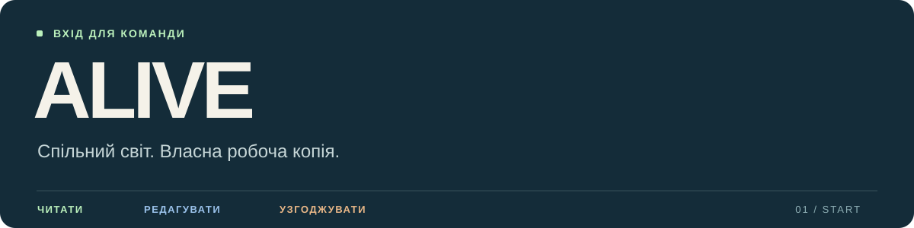

# Початок роботи

> [!TIP]
> **Можна доручити підключення агенту:** [повна інструкція встановлення](AGENT_SETUP.md) включає Obsidian, Git, авторизацію та плагін для автоматичного отримання змін. Після налаштування щоденна робота відбувається в Obsidian через [дашборд команди](TEAM_DASHBOARD.md) і панель Git. Нижче збережено ручний маршрут через GitHub Desktop.

**Встановіть дві програми → отримайте доступ → відкрийте свою копію вікі.**

У кожного учасника буде власна папка ALIVE на комп’ютері. **Obsidian** показує її як вікі, **GitHub Desktop** отримує та передає зміни, а **ваш агент** допомагає працювати з текстами й версіями.

[1. Програми](#1-встановіть-програми) · [2. Доступ](#2-отримайте-доступ) · [3. Копія проєкту](#3-завантажте-робочу-копію) · [4. Вікі](#4-відкрийте-вікі-в-obsidian) · [5. Агент](#5-підключіть-свого-агента) · [Щоденна робота](#щоденна-робота)

> [!NOTE]
> **Хочете поки лише читати?** Якщо репозиторій публічний, читання доступне одразу; для приватного доступу прийміть запрошення. Відкрийте [головну сторінку ALIVE](README.md) у браузері. Для локальної вікі й редагування пройдіть кроки нижче.

---

## 1. Встановіть програми

> [!IMPORTANT]
> **GitHub Desktop потрібно окремо завантажити й установити.** Акаунт на сайті GitHub не встановлює цю програму. Для описаного нижче способу роботи потрібні **і GitHub Desktop, і Obsidian**.

| Програма | Для чого вона | Офіційне завантаження |
| :--- | :--- | :--- |
| **GitHub Desktop** | Завантажити ALIVE на комп’ютер, отримувати оновлення, передавати правки | **[↓ Завантажити GitHub Desktop](https://desktop.github.com/)** |
| **Obsidian** | Читати й редагувати біблію як зв’язану вікі | **[↓ Завантажити Obsidian](https://obsidian.md/download)** |

**GitHub Desktop:**

- **macOS:** завантажте версію для Mac, розпакуйте ZIP, перенесіть GitHub Desktop у **Applications / Програми** й відкрийте.
- **Windows:** завантажте версію для Windows, запустіть інсталяційний файл і завершіть установлення.

**Obsidian:** на сторінці завантаження виберіть свою операційну систему. На Mac відкрийте DMG й перенесіть програму в **Applications / Програми**; на Windows запустіть інсталятор.

**Перевірка:** обидві програми встановлені й відкриваються на вашому комп’ютері.

> [!TIP]
> **Цей спосіб не потребує платного Obsidian Sync.** GitHub Desktop і базовий Obsidian безкоштовні. Інструкція розрахована на macOS та Windows; для Linux підключення через Git допоможе налаштувати агент.

## 2. Отримайте доступ

1. Створіть власний безкоштовний [акаунт GitHub](https://github.com/signup), якщо його ще немає.
2. Передайте адміністратору проєкту свій **GitHub-логін** — ім’я профілю на GitHub.
3. Прийміть запрошення для редагування **[esannikov/Alive](https://github.com/esannikov/Alive)**, увійшовши у свій акаунт.
4. Відкрийте репозиторій у браузері й перевірте, що бачите його файли.
5. Запустіть **GitHub Desktop** → **Sign in to GitHub.com**. Завершіть вхід у браузері через **цей самий акаунт**.

> [!WARNING]
> **Бачите 404 або не знаходите Alive?** Перевірте, чи прийняли запрошення і чи ввійшли в потрібний акаунт. Приватний репозиторій стає доступним після запрошення; ця інструкція сама доступу не надає.

Пароль і токен передавати адміністратору або агенту не потрібно. Використовуйте звичайний вхід через браузер.

## 3. Завантажте робочу копію

**У GitHub Desktop:**

1. Оберіть **File → Clone repository**.
2. Знайдіть **esannikov/Alive** у списку. Або відкрийте вкладку **URL** і вставте:

   ```text
   https://github.com/esannikov/Alive.git
   ```

3. У полі **Local Path** виберіть місце для папки **Alive**. Запам’ятайте його — цю папку ви відкриєте в Obsidian.
4. Натисніть **Clone** і дочекайтеся завершення.

**Перевірка:** у локальній папці є `README.md`, `START_HERE.md`, папки `Bible` і `Sources`.

> [!NOTE]
> **Оберіть звичайну локальну папку поза iCloud, OneDrive та іншими сервісами синхронізації.** Обмін змінами цього проєкту вже виконує Git. Кнопка **Download ZIP** дає лише разовий знімок і не налаштовує синхронізацію.

## 4. Відкрийте вікі в Obsidian

1. Запустіть **Obsidian**.
2. У виборі сховища оберіть **Open folder as vault / Відкрити папку як сховище**.
3. Укажіть **саме папку Alive з попереднього кроку**.
4. Відкрийте `README.md` — це головна сторінка вікі. Для зручного читання перемкніть нотатку в **Reading view / Режим читання**.

| Що шукаєте | Відкрити |
| :--- | :--- |
| Герої, зовнішність і костюми | [Персонажі](Bible/Characters.md) |
| Устрій станції та правила | [Світ](Bible/World.md) |
| Приміщення, предмети й усі тематичні розділи | [Карта біблії](Bible/README.md) |
| Актуальний роман | [ALIVE.pdf](Sources/ALIVE.pdf) |

> [!TIP]
> **Вікі готова.** Якщо сторінки відкриваються, а посилання ведуть між ними, підключення завершене. Сторонні плагіни для цього не потрібні.

## 5. Підключіть свого агента

Відкрийте папку **Alive** у програмі свого агента або надайте йому доступ до цієї папки. Він працюватиме з тими самими файлами, які ви бачите в Obsidian.

**Скопіюйте агенту цей текст:**

```text
Підключаємося до проєкту ALIVE:
https://github.com/esannikov/Alive

Перевір, чи є на комп’ютері локальна копія репозиторію.
Якщо її немає — допоможи клонувати проєкт через мій GitHub-акаунт.
Вхід у браузері я виконаю самостійно.

Якщо копія вже існує, перевір її гілку й незбережені зміни.
Збережи мою незавершену роботу перед оновленням.

Прочитай AGENT_SETUP.md, потім AGENTS.md і CONTRIBUTING.md.
За повною інструкцією встанови відсутні компоненти й налаштуй плагін Git.
Перевір доступ на читання та редагування.
Покажи, яку папку відкрити в Obsidian і де головна сторінка.

Нові правки готуй в окремій гілці й передавай через pull request.
Перед прийманням покажи зміни людині.
```

Агент користується вашою авторизацією; окремий акаунт GitHub для нього не потрібний. Браузерному чату без доступу до локальних файлів потрібен окремо налаштований GitHub-конектор.

---

## Щоденна робота

### Отримати оновлення

**З налаштованим плагіном Git:** відкрийте main в Obsidian; оновлення надходитимуть кожні 5 хвилин і при запуску. Після редактури поверніться до чистої main й відновіть автоматику за [правилами дашборда](TEAM_DASHBOARD.md). Нижче — ручний спосіб для копій без плагіна.

**GitHub Desktop → Alive → Fetch origin → Pull origin**, якщо ця кнопка з’явиться. Для отримання прийнятої версії потрібна гілка **main**.

Якщо у вас є незавершені правки або відкрита інша гілка, спочатку попросіть агента перевірити стан:

> Перевір мої незбережені зміни й онови ALIVE до останньої прийнятої версії. Збережи мою незавершену роботу.

### Запропонувати правку

Перед редагуванням попросіть агента створити окрему робочу гілку. Далі редагуйте тексти в Obsidian. Після завершення:

> Покажи мої зміни, перевір посилання і створи запит на перегляд. Відділи редактуру формулювань від нових фактів світу.

**Для ручної роботи через плагін:** коли агент уже підготував вашу робочу гілку, можна самому написати текст і виконати **Ctrl+P / Cmd+P → Git: Commit-and-sync**. Це збереже та відправить поточні правки; запит на перегляд готує агент або відповідальний редактор. [Короткий маршрут](TEAM_DASHBOARD.md#відправити-написане-однією-командою).

**Правка → перегляд людиною → приймання → оновлення інших копій.** Якщо двоє учасників змінили один фрагмент, агент показує обидва варіанти для погодження.

### Обговорити питання

| Потрібно | Де писати |
| :--- | :--- |
| Прокоментувати конкретну правку | У відповідному **pull request** |
| Поставити окреме питання про світ | У вкладці **Issues** репозиторію |
| Зберегти прийняте творче рішення | За правилами [журналу рішень](Decisions/README.md) |

Коментарі зберігаються на GitHub. Агент читає їх через GitHub-доступ; звичайне оновлення папки не завантажує обговорення.

---

**Далі:** [Відкрити ALIVE](README.md) · [Правила внесення змін](CONTRIBUTING.md) · [Інструкції агентам](AGENTS.md)
